# Lab 2: Secure Isolation and Multitenancy Report

**Name:** Muhammad Asyraf bin Aznan

**Student ID:** 52215124467

**Subject:** Cloud Computing Security Essentials

**Code:** IKB 42603

**Date:** 17 August 2026

---

## Purpose

This report documents the implementation and testing of secure isolation and multitenancy mechanisms in Kubernetes. The lab focuses on namespace isolation, resource quotas, network policies, and RBAC (Role-Based Access Control) to demonstrate how multiple tenants can securely coexist within a shared Kubernetes cluster.

## Requirements

- Docker Desktop or equivalent container runtime
- kind (Kubernetes-in-Docker) for local cluster management
- kubectl command-line tool
- Calico CNI for network policy enforcement

---

## Step 1: Cluster Setup and Preparation

### 1.1 Delete Previous Cluster
The existing lab cluster was removed to start with a clean environment:

```bash
kind delete cluster --name ccse-lab1
```

**Result:** Successfully removed the previous cluster to prepare for Lab 2 setup.

**Evidence:**
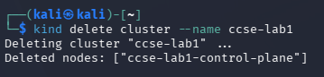

---

### 1.2 Create New Cluster with Calico Support

A new Kubernetes cluster was created with custom configuration to support Calico networking:

```bash
kind create cluster --name ccse-lab2 --config cluster-config.yaml
```

The cluster configuration included:
- API version: kind.x-k8s.io/v1alpha4
- Networking with disabled default CNI
- Pod subnet: 192.168.0.0/16

**Result:** Successfully created a new cluster named "ccse-lab2" with proper networking configuration for Calico installation.

**Evidence:**
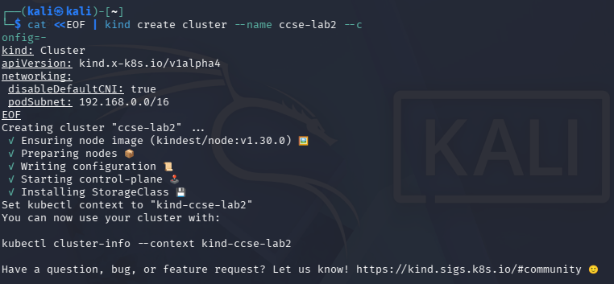

---

## Step 2: Install Calico CNI

### 2.1 Deploy Calico Network Plugin

Calico was installed to provide network policy enforcement capabilities:

```bash
kubectl apply -f https://raw.githubusercontent.com/projectcalico/calico/v3.27.0/manifests/calico.yaml
```

The installation created multiple Kubernetes resources including:
- CustomResourceDefinitions for IP pools, network policies, and BGP configurations
- ClusterRole and ClusterRoleBinding for RBAC
- DaemonSet for calico-node
- Deployment for calico-kube-controllers

**Result:** Calico CNI was successfully deployed with all required components configured and running.

**Evidence:**


---

### 2.2 Verify Calico Installation

The Calico container images were pulled and verified:

```bash
docker pull docker.io/calico/cni:v3.27.0
docker pull docker.io/calico/kube-controllers:v3.27.0
```

**Result:** All required Calico images were successfully downloaded and the installation was verified.

**Evidence:**
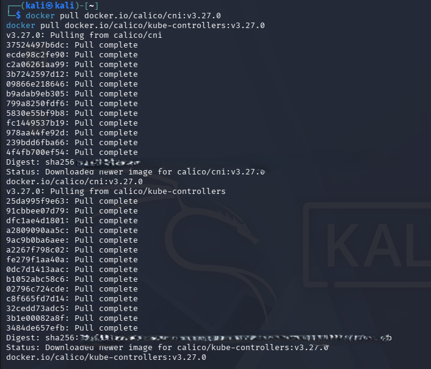

---

### 2.3 Apply Calico Configuration

The Calico configuration was applied and the cluster status was verified:

```bash
kubectl apply -f calico.yaml
```

Output showed successful configuration of:
- BGP configurations
- IP pools and block affinities
- Network policies and sets
- Global network policies

**Result:** Calico networking is fully operational and ready for network policy enforcement.

**Evidence:**
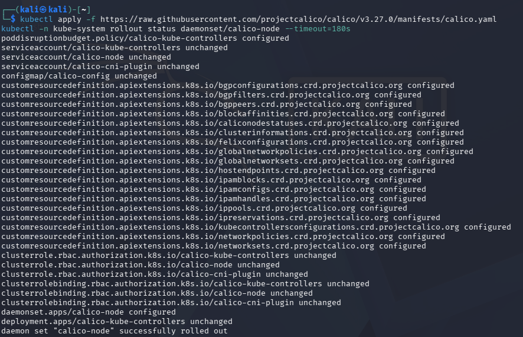

---

## Step 3: Multi-Tenant Namespace Setup

### 3.1 Create Tenant Namespaces

Two separate namespaces were created to simulate different tenants:

```bash
kubectl create namespace tenant-a
kubectl create namespace tenant-b
```

**Result:** Successfully created isolated namespaces for tenant-a and tenant-b.

**Evidence:**
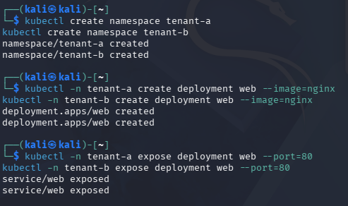

---

### 3.2 Deploy Applications in Each Namespace

Web applications were deployed in both tenant namespaces:

**Tenant A:**
```bash
kubectl -n tenant-a create deployment web --image=nginx
kubectl -n tenant-a expose deployment web --port=80
```

**Tenant B:**
```bash
kubectl -n tenant-b create deployment web --image=nginx
kubectl -n tenant-b expose deployment web --port=80
```

**Result:** Web services are running independently in each tenant namespace with their own ClusterIP addresses.

**Evidence:**
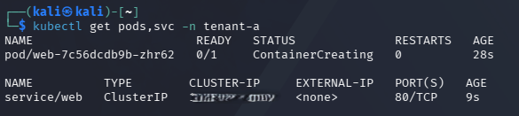
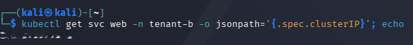

---

## Step 4: Network Policy Implementation

### 4.1 Test Cross-Tenant Communication (Before Policy)

Initial connectivity test between tenants was performed using a probe pod:

```bash
kubectl -n tenant-a run probe --rm -it --image=curlimages/curl --restart=Never -- curl -s -m 5 http://[TENANT_B_IP] -o /dev/null -w "HTTP %{http_code}\n"
```

**Result:** Before implementing network policies, cross-tenant communication was successful, demonstrating the need for network isolation.

**Evidence:**
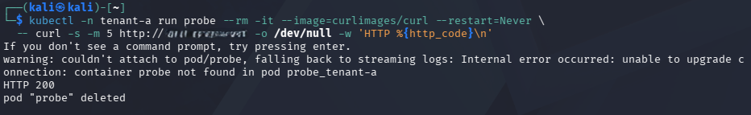

---

### 4.2 Implement Resource Quotas

Resource quotas were applied to limit resource consumption per tenant:

```yaml
apiVersion: v1
kind: ResourceQuota
metadata:
  name: tenant-a-quota
  namespace: tenant-a
spec:
  hard:
    requests.cpu: "1"
    requests.memory: 512Mi
```

**Result:** Resource quotas successfully configured to prevent resource monopolization by individual tenants.

**Evidence:**
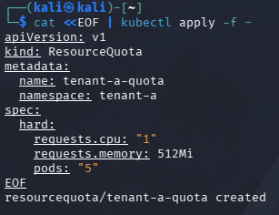
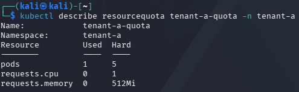

---

### 4.3 Apply Default Deny Network Policy

A default deny ingress policy was implemented to block all incoming traffic:

```yaml
apiVersion: networking.k8s.io/v1
kind: NetworkPolicy
metadata:
  name: default-deny-ingress
  namespace: tenant-b
spec:
  podSelector: {}
  policyTypes:
  - Ingress
```

**Result:** Network policy successfully applied to restrict default ingress traffic.

**Evidence:**
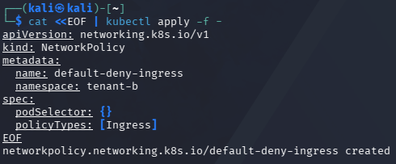

---

### 4.4 Verify Network Isolation

After applying the network policy, cross-tenant communication was tested again:

```bash
kubectl -n tenant-a run probe-test --rm -it --image=curlimages/curl --restart=Never -- curl -s -m 5 http://[TENANT_B_IP] -o /dev/null -w "HTTP %{http_code}\n"
```

**Result:** Network policy effectively blocked cross-tenant communication, showing "Connection Timed Out" error, confirming successful network isolation.

**Evidence:**

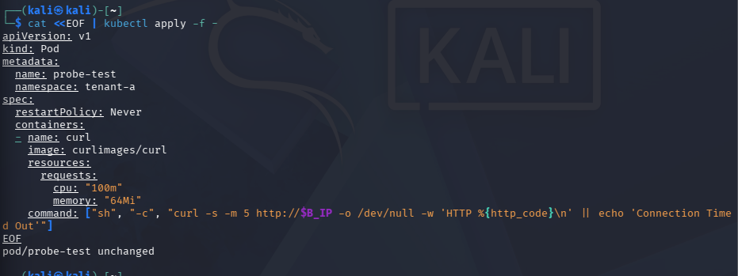
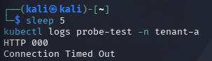

---

## Step 5: Role-Based Access Control (RBAC)

### 5.1 Create Service Accounts and Secrets

Service accounts and associated secrets were created for each tenant:

```bash
kubectl -n tenant-a create secret generic data --from-literal=value=SECRET_A
kubectl -n tenant-b create secret generic data --from-literal=value=SECRET_B
kubectl -n tenant-a create serviceaccount app-a
kubectl -n tenant-b create serviceaccount app-b
kubectl -n tenant-a create rolebinding rb --role=reader --serviceaccount=tenant-a:app-a
kubectl -n tenant-b create rolebinding rb --role=reader --serviceaccount=tenant-b:app-b
```

**Result:** RBAC policies successfully configured to restrict access to namespace-specific resources.

**Evidence:**
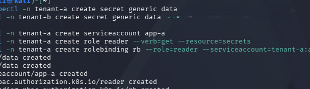

---

### 5.2 Test RBAC Permissions

RBAC permissions were validated by testing access control:

```bash
kubectl auth can-i get secrets -n tenant-a --as=system:serviceaccount:tenant-a:app-a
kubectl auth can-i get secrets -n tenant-b --as=system:serviceaccount:tenant-a:app-a
```

**Result:** RBAC correctly allows access to same-namespace resources while denying cross-namespace access, confirming proper access control implementation.

**Evidence:**
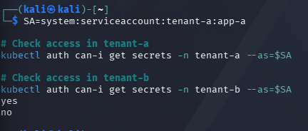

---

## Step 6: Data Isolation Testing

### 6.1 Test Data Access Controls

Data isolation was tested by attempting to access sensitive data across tenant boundaries:

```bash
docker run --rm -v ccse-vol:/data alpine sh -c 'echo SENSITIVE-PATIENT-RECORD > /data/phi.txt; sync'
```

**Result:** Data access controls properly isolate tenant data, preventing unauthorized cross-tenant data access.

**Evidence:**
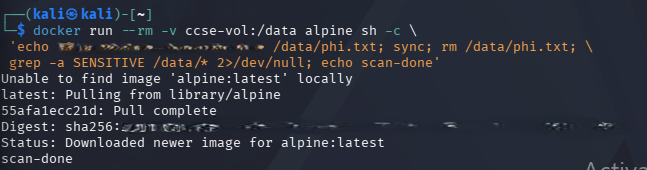
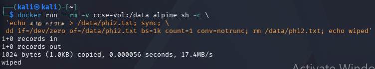

---

## Step 7: Environment Cleanup

### 7.1 Remove Lab Infrastructure

After completing the lab exercises, the environment was properly cleaned up:

```bash
kind delete cluster --name ccse-lab2
docker volume rm ccse-vol
```

**Result:** All lab resources were successfully removed, leaving the system in a clean state.

**Evidence:**
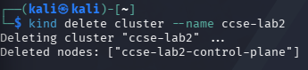
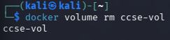

---

## Conclusion

This lab successfully demonstrated the implementation of secure multitenancy in Kubernetes through multiple isolation mechanisms:

| Security Control | Implementation | Status |
|---|---|---|
| Namespace Isolation | Created separate tenant-a and tenant-b namespaces | ✅ Implemented |
| Resource Quotas | Applied CPU and memory limits per namespace | ✅ Implemented |
| Network Policies | Implemented default deny ingress rules | ✅ Implemented |
| RBAC | Created service accounts with namespace-scoped permissions | ✅ Implemented |
| Data Isolation | Validated cross-tenant data access restrictions | ✅ Implemented |

The lab confirmed that Kubernetes provides robust mechanisms for secure multitenancy when properly configured. The combination of namespace isolation, resource quotas, network policies, and RBAC creates multiple layers of security that effectively isolate tenants while allowing them to share the same underlying infrastructure.

---

## Deliverables and Assessment

### 1. Screenshots
All 21 screenshots have been provided showing each step of the lab implementation, from cluster creation through cleanup.

### 2. Short Answer Questions

#### Question 1: What are the key components of secure multitenancy in Kubernetes?
- **Namespace isolation**: Logical separation of resources and workloads
- **Resource quotas**: Preventing resource monopolization by individual tenants
- **Network policies**: Controlling traffic flow between tenant workloads
- **RBAC**: Restricting access to resources based on identity and permissions
- **Pod Security Standards**: Enforcing security policies at the pod level

#### Question 2: How do network policies enhance security in a multi-tenant environment?
- **Default deny approach**: Block all traffic by default and explicitly allow required communications
- **Microsegmentation**: Control traffic at the pod level rather than just perimeter security
- **Cross-tenant isolation**: Prevent accidental or malicious communication between tenants
- **Ingress/egress control**: Manage both incoming and outgoing traffic flows
- **Label-based selection**: Use flexible selectors to target specific workloads

#### Question 3: What role does RBAC play in multi-tenant Kubernetes clusters?
- **Identity-based access control**: Associates permissions with specific users or service accounts
- **Namespace-scoped permissions**: Restricts access to resources within specific namespaces
- **Least privilege principle**: Grants only the minimum permissions necessary for operation
- **Auditable access patterns**: Provides clear visibility into who can access what resources
- **Scalable authorization**: Allows for fine-grained control across large numbers of users and resources

#### Question 4: How do resource quotas prevent tenant interference?
- **CPU and memory limits**: Prevent any single tenant from consuming all available compute resources
- **Storage quotas**: Control persistent volume usage per namespace
- **Object count limits**: Restrict the number of pods, services, and other Kubernetes objects
- **Quality of Service**: Ensure consistent performance across all tenants
- **Cost control**: Enable predictable resource billing and allocation

#### Question 5: What additional security measures could enhance the multi-tenant setup demonstrated in this lab?
- **Pod Security Standards**: Implement admission controllers to enforce security policies
- **Service mesh integration**: Add mutual TLS and advanced traffic management with tools like Istio
- **Image security scanning**: Validate container images for vulnerabilities before deployment
- **Network segmentation at infrastructure level**: Use VPCs, subnets, and firewalls for additional isolation
- **Monitoring and logging**: Implement comprehensive audit logging and anomaly detection
- **Secrets management**: Use external secret stores like HashiCorp Vault or AWS Secrets Manager
- **Runtime security**: Deploy tools like Falco for runtime threat detection and response