# Lab 3: Data Protection — Encryption & Key Management

**Name:** Muhammad Asyraf bin Aznan

**Student ID:** 52215124467

**Subject:** Cloud Computing Security Essentials

**Code:** IKB 42603

**Date:** 18 August 2026

---

## Purpose

This report documents the completion of Lab 3, covering data protection techniques including symmetric and asymmetric encryption, TLS for data in transit, KMS-based key management, envelope encryption, per-tenant key isolation, cryptographic erasure, and hash-based integrity verification. All tasks were performed using OpenSSL and LocalStack KMS inside Git Bash on Windows.

## Lab Learning Outcomes

- Encrypt and decrypt data with symmetric (AES) and asymmetric (RSA) cryptography.
- Protect data in transit with TLS and observe the difference between plaintext and encrypted traffic.
- Use a Key Management Service (KMS) and implement envelope encryption.
- Apply per-tenant keys and perform cryptographic erasure to make data provably unrecoverable.
- Verify data integrity with hashing and build a tamper-evident (hash-chained) record.

---

## Session A (Week 5) — Encryption Fundamentals

---

## Task 1 — Symmetric Encryption (Data at Rest)

A sample sensitive patient record was created and encrypted using AES-256-CBC with PBKDF2 key derivation. The encrypted file was confirmed unreadable, and a successful decryption was verified using `diff`.

```bash
# Create a sample sensitive record
echo 'Patient: Ahmad, Diagnosis: confidential' > record.txt

# Encrypt with AES-256 (prompted for a passphrase)
openssl enc -aes-256-cbc -pbkdf2 -salt -in record.txt -out record.enc

# Prove it is unreadable
cat record.enc

# Decrypt back
openssl enc -d -aes-256-cbc -pbkdf2 -in record.enc -out record.dec.txt
diff record.txt record.dec.txt && echo 'MATCH: decryption successful'
```

**Result:** The `diff` command produced no output and the confirmation message `MATCH: decryption successful` was printed, confirming that the decrypted file is byte-for-byte identical to the original.

**Evidence:**

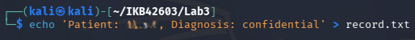
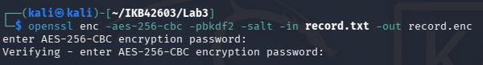
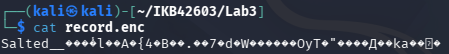
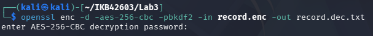
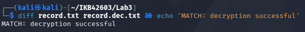

---

## Task 2 — Asymmetric Encryption & Digital Signatures

A 2048-bit RSA key pair was generated. The public key was used to encrypt the record file and the private key was used to decrypt it. The private key was then used to produce a digital signature, which was verified with the public key.

```bash
# Generate a 2048-bit key pair
openssl genrsa -out private.pem 2048
openssl rsa -in private.pem -pubout -out public.pem

# Encrypt with the PUBLIC key, decrypt with the PRIVATE key
openssl pkeyutl -encrypt -pubin -inkey public.pem -in record.txt -out record.rsa
openssl pkeyutl -decrypt -inkey private.pem -in record.rsa -out record.rsa.txt

# Sign with the PRIVATE key; verify with the PUBLIC key
openssl dgst -sha256 -sign private.pem -out record.sig record.txt
openssl dgst -sha256 -verify public.pem -signature record.sig record.txt
```

**Result:** Decryption recovered the original plaintext. The signature verification command returned `Verified OK`, confirming both the authenticity and integrity of the file.

**Evidence:**

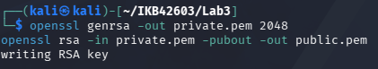
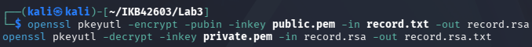
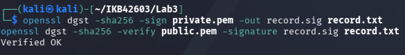

---

## Task 3 — Encryption in Transit (TLS)

A self-signed TLS certificate was generated for `localhost`. An Nginx container was run with the certificate and key mounted, serving `record.txt` over HTTPS on port 8443. The file was fetched using `curl` with the `-k` flag to accept the self-signed certificate.

```bash
# Generate a self-signed certificate
openssl req -x509 -newkey rsa:2048 -keyout key.pem -out cert.pem \
  -days 7 -nodes -subj '/CN=localhost'

# Serve HTTPS on port 8443 using a small container
docker run --rm -d --name tls -p 8443:443 \
  -v $(pwd)/cert.pem:/etc/nginx/cert.pem \
  -v $(pwd)/key.pem:/etc/nginx/key.pem \
  -v $(pwd)/record.txt:/usr/share/nginx/html/record.txt nginx

# Connect over TLS (-k accepts the self-signed cert)
curl -k https://localhost:8443/record.txt
```

**Result:** The `curl` command successfully retrieved `record.txt` over HTTPS, with the TLS handshake completed against the self-signed certificate. The plaintext record content was displayed in the terminal, confirming the channel was encrypted end-to-end.

> **Security note:** Over plain HTTP the record would travel in cleartext, readable by any on-path attacker. TLS ensures intercepted traffic is ciphertext only.

The TLS container was stopped at the end of Session A:

```bash
docker stop tls
```

**Evidence:**

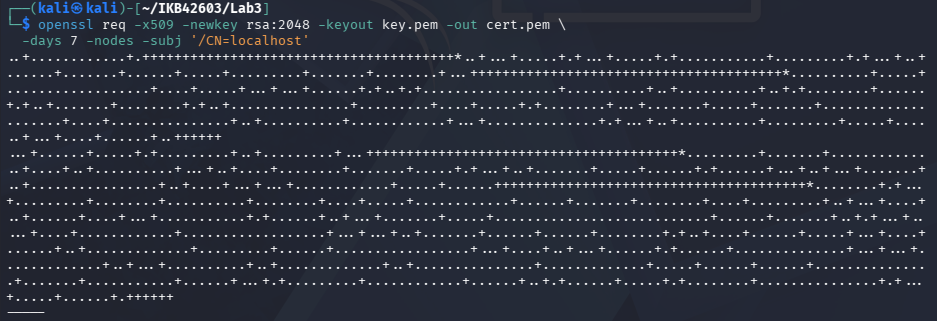
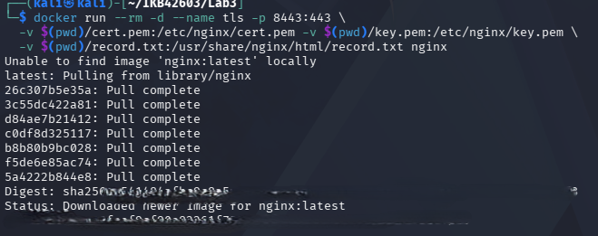
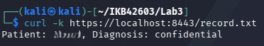
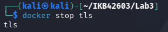

---

## Session B (Week 6) — Key Management, Envelope Encryption & Erasure

LocalStack was started and the AWS CLI endpoint variable was set before beginning Session B tasks:

```bash
EP='--endpoint-url=http://localhost:4566'
```

---

## Task 4 — Create and Use a KMS Master Key

A Customer Master Key (CMK) was created in LocalStack KMS for Tenant A. The returned `KeyId` was captured and used to perform a direct KMS encryption of a small secret.

```bash
# Create a customer master key (CMK)
aws $EP kms create-key --description 'CCSE tenant-A master key'

# Set the KeyId from the output
KEY_A=<KeyId from output>

# Encrypt a small secret directly with KMS
aws $EP kms encrypt \
  --key-id $KEY_A \
  --plaintext "$(echo -n 'hello' | base64)" \
  --query CiphertextBlob \
  --output text
```

**Result:** LocalStack KMS returned a `KeyId` and full ARN for the new CMK. The encrypt call returned a base64-encoded `CiphertextBlob`, confirming the KMS master key is operational.

**Evidence:**

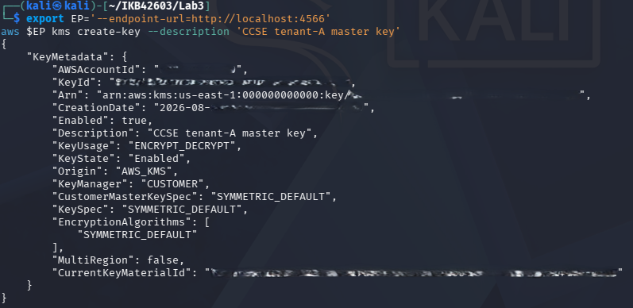


---

## Task 5 — Envelope Encryption

Instead of encrypting large data directly with the master key, KMS was asked to generate a data key. The plaintext copy was used locally to encrypt `record.txt` with AES-256, then immediately destroyed. Only the KMS-wrapped (encrypted) copy of the data key was retained on disk alongside the ciphertext.

```bash
# 5.1 Ask KMS for a data key (returns plaintext + encrypted versions)
aws $EP kms generate-data-key \
  --key-id $KEY_A \
  --key-spec AES_256 \
  --query '[Plaintext,CiphertextBlob]' \
  --output text

# Save column 1 as datakey.b64 (plaintext) and column 2 as datakey.enc (wrapped)

# 5.2 Encrypt the big file locally with the PLAINTEXT data key
base64 -d datakey.b64 > datakey.bin
openssl enc -aes-256-cbc -pbkdf2 -in record.txt -out record.env.enc \
  -pass file:./datakey.bin

# 5.3 Destroy the plaintext data key from disk — keep only the wrapped copy
rm datakey.bin datakey.b64
echo 'Only the KMS-wrapped data key (datakey.enc) remains.'
```

**Result:** `record.env.enc` was created successfully. After running `rm`, the plaintext data key no longer exists on disk. Only `datakey.enc` (the KMS-wrapped version) and `record.env.enc` remain, as confirmed by `ls`.

**Evidence:**

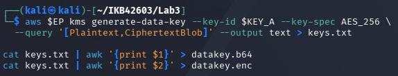
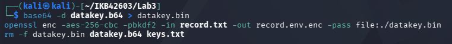
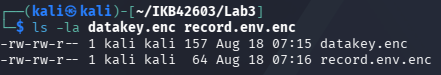

---

## Task 6 — Per-Tenant Keys & Cryptographic Erasure

A second CMK was created for Tenant B to demonstrate key isolation. Tenant A's key was then scheduled for deletion and immediately disabled. An attempt to unwrap Tenant A's data key was made and failed, proving cryptographic erasure.

```bash
# A separate key for tenant B
aws $EP kms create-key --description 'CCSE tenant-B master key'
KEY_B=<KeyId from output>

# Schedule deletion of tenant A's key (minimum window = 7 days)
aws $EP kms schedule-key-deletion --key-id $KEY_A --pending-window-in-days 7

# Disable it immediately to simulate erasure
aws $EP kms disable-key --key-id $KEY_A

# Attempt to unwrap tenant A's data key now — it should FAIL
aws $EP kms decrypt --ciphertext-blob fileb://datakey.enc 2>&1 | head -3
```

**Result:** The `kms decrypt` command failed with a `KMSInvalidStateException` or `DisabledException` error, confirming that disabling the master key makes the wrapped data key — and by extension `record.env.enc` — permanently unreadable. Tenant B's key was unaffected.

> **Caution:** Once the key that wrapped the data key is gone, `record.env.enc` is just noise. No one, not even the provider, can decrypt it. This is why per-object/per-tenant keys make deletion provable.

**Evidence:**

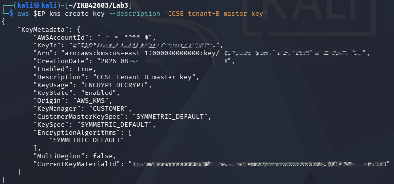
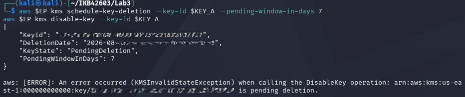

---

## Task 7 — Integrity & Tamper-Evidence

The SHA-256 fingerprint of `record.txt` was computed. A tampered copy was created and its hash was shown to differ. A simple hash chain was then constructed where each entry commits to the previous hash, producing a tamper-evident log.

```bash
# Fingerprint the file
sha256sum record.txt

# Tamper with a copy and show the hash changes
cp record.txt tampered.txt; echo 'x' >> tampered.txt
sha256sum record.txt tampered.txt

# Hash chain: each entry includes the previous hash (tamper-evident log)
PREV=0
for line in 'login ok' 'file read' 'export data'; do
  PREV=$(echo -n "$PREV$line" | sha256sum | cut -d' ' -f1)
  echo "$line | $PREV"
done
```

**Result:** The two `sha256sum` outputs differed completely despite only a single character being appended — demonstrating hash sensitivity (avalanche effect). The hash chain output showed three chained log entries, each entry's hash depending on all prior entries, making retroactive tampering detectable.

**Evidence:**

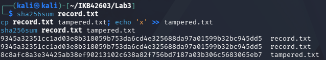
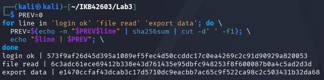

---

## Security Best-Practices Checklist

| Control | Status |
|---|---|
| Data encrypted at rest (AES) and decryption verified | ✅ Done |
| Asymmetric keys used correctly (encrypt with public, sign with private) | ✅ Done |
| Data protected in transit with TLS | ✅ Done |
| Envelope encryption used; plaintext data key not left on disk | ✅ Done |
| Per-tenant keys used; cryptographic erasure demonstrated | ✅ Done |
| Integrity verified with hashing / hash chain | ✅ Done |

---

## Deliverables & Assessment

### Short-Answer Questions

**Q1. Compare symmetric and asymmetric encryption: speed, key distribution, and typical use.**

- Symmetric (AES) is much faster; suited for bulk data encryption.
- Asymmetric (RSA) is slower; uses modular exponentiation on large numbers.
- Symmetric requires both parties to share the same secret key securely.
- Asymmetric solves this — public key is shared openly; private key stays secret.
- AES is used for files, disks, and the data phase of TLS.
- RSA/ECC is used for key exchange, signatures, and certificates.
- Envelope encryption combines both for speed and strong key control.

---

**Q2. Why is key management described as the weakest link, not the algorithm?**

- AES-256 and RSA-2048 are mathematically unbreakable with current computing.
- The real risk is how keys are stored, rotated, and revoked.
- Keys hardcoded or stored in plaintext config files are easily stolen.
- Stealing a key defeats encryption instantly — no brute-force needed.
- Over-privileged IAM roles expose keys to unintended cloud principals.
- KMS and HSMs exist to enforce access control and prevent key export.

---

**Q3. Explain envelope encryption and why only the master key needs hardware-grade protection.**

- A per-record data key (AES-256) encrypts the actual data locally.
- The data key is then wrapped (encrypted) by the KMS master key (CMK).
- Only the wrapped data key and ciphertext are stored on disk.
- The plaintext data key is destroyed immediately after local encryption.
- Only one master key exists per tenant — practical to protect in HSM.
- Data keys are ephemeral; they never persist outside memory.
- Compromising one data key affects only one record, not all data.
- Master key never leaves the HSM; KMS decrypts inside the hardware boundary.

---

**Q4. How does cryptographic erasure achieve provable deletion where overwriting cannot (in the cloud)?**

- Cloud data exists across replicas, snapshots, and backups simultaneously.
- Issuing "delete" cannot guarantee all physical copies are wiped.
- Every object is encrypted with a unique per-tenant data key.
- Deleting the master key renders all wrapped data keys permanently useless.
- All ciphertext copies become unreadable noise without the key.
- KMS audit logs (CloudTrail) provide a timestamped, verifiable deletion proof.
- Overwriting cannot prove all copies were reached; key deletion can.
- Used for GDPR "right to be forgotten" in cloud environments.

---

**Q5. How does a hash chain make a log tamper-evident?**

- Each entry's hash is computed over `previous_hash + current_entry`.
- Modifying any past entry changes its hash and all subsequent hashes.
- An observer recomputes the chain and detects the mismatch immediately.
- Tamper-evident only — attacker with write access can recompute the chain.
- Tamper-proof requires anchoring the chain tip to an external trusted store.
- AWS CloudTrail uses hash-chained digests signed and stored in S3.
- Auditors validate the full chain to confirm no records were altered.


