# Lab 6: Object Storage Security & Data Lifecycle

**Name:** Muhammad Asyraf bin Aznan

**Student ID:** 52215124467

**Subject:** Cloud Computing Security Essentials

**Code:** IKB 42603

**Date:** 3 September 2026

---

## Purpose

This report documents the completion of Lab 6, covering object storage security and the data security lifecycle using Amazon S3 on LocalStack. The lab covers bucket exposure and remediation, resource-based vs identity-based policies, SSE-KMS default encryption, presigned URLs, versioning and data remanence, lifecycle rules, and cryptographic erasure.

## Lab Learning Outcomes

- Provision object storage, classify data, and explain the object storage security model.
- Reproduce the archetypal public-bucket breach and remediate it with Block Public Access and least-privilege policy.
- Distinguish identity-based (IAM) from resource-based (bucket policy) authorisation and predict outcomes when they disagree.
- Enforce encryption at rest with SSE-KMS.
- Issue time-bounded delegated access with presigned URLs and assess their risks.
- Apply versioning, lifecycle and retention rules, demonstrate data remanence, and achieve provable deletion through cryptographic erasure.

---

## Session A (Week 11) — Object Storage & the Exposure Problem

---

## One-Time Environment Setup

LocalStack was started with `ENFORCE_IAM=1` to enable real IAM policy evaluation, and the AWS CLI was pointed at the local endpoint.

```bash
docker rm -f localstack 2>/dev/null
docker run -d --name localstack -p 4566:4566 \
  -e LOCALSTACK_AUTH_TOKEN=$LOCALSTACK_AUTH_TOKEN \
  -e ENFORCE_IAM=1 \
  localstack/localstack-pro:latest

export EP='--endpoint-url=http://localhost:4566'
aws configure set aws_access_key_id test
aws configure set aws_secret_access_key test
aws configure set region us-east-1
aws $EP sts get-caller-identity
```

The caller identity returned the LocalStack dummy account `000000000000`.

---

## Task 1 — Classify the Data Before You Store It

A bucket was created for a hospital records system and three objects of different sensitivity were stored, each tagged with its classification level.

```bash
export BUCKET=miit-patient-records-[REDACTED]
echo $BUCKET
aws $EP s3api create-bucket --bucket $BUCKET

echo 'Ward visiting hours 10am-8pm' > public-notice.txt
echo 'Staff duty schedule, week 12' > internal-roster.txt
echo 'Patient: [REDACTED], Diagnosis: [REDACTED]' > confidential-record.txt

aws $EP s3api put-object --bucket $BUCKET --key public/notice.txt \
  --body public-notice.txt --tagging 'classification=public'
aws $EP s3api put-object --bucket $BUCKET --key internal/roster.txt \
  --body internal-roster.txt --tagging 'classification=internal'
aws $EP s3api put-object --bucket $BUCKET --key confidential/record.txt \
  --body confidential-record.txt --tagging 'classification=confidential'

aws $EP s3api list-objects-v2 --bucket $BUCKET \
  --query 'Contents[].[Key,Size]' --output table
aws $EP s3api get-object-tagging --bucket $BUCKET --key confidential/record.txt
```

**Result:** Three objects were successfully created with classification tags: `public`, `internal`, and `confidential`.

**Evidence:**

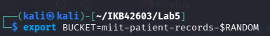
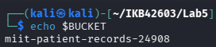

### Data Classification Table

| Classification | Who may read it | Impact if leaked | Control applied |
|---|---|---|---|
| public | Anyone | Minimal — intended for public viewing | No access restriction; public bucket policy scoped to `public/` prefix |
| internal | Authenticated internal users only | Moderate — operational data exposure | Least-privilege bucket policy scoped to `internal/` prefix for account root |
| confidential | Authorised personnel only | High — patient PHI exposure, regulatory breach | Explicit Deny bucket policy on `confidential/` prefix; SSE-KMS encryption |

---

## Task 2 — Reproduce the Archetypal Breach

A bucket policy with `"Principal": "*"` was deliberately applied to simulate the most common cloud data breach, then the confidential record was accessed with no credentials at all.

```bash
cat > public-policy.json <<JSON
{
  "Version": "2012-10-17",
  "Statement": [{
    "Sid": "PublicReadEverything",
    "Effect": "Allow",
    "Principal": "*",
    "Action": "s3:GetObject",
    "Resource": "arn:aws:s3:::[REDACTED]/*"
  }]
}
JSON

aws $EP s3api put-bucket-policy --bucket $BUCKET --policy file://public-policy.json
aws $EP s3api get-bucket-policy --bucket $BUCKET --query Policy --output text

curl -s -o leaked.txt -w 'HTTP %{http_code}\n' \
  http://localhost:4566/$BUCKET/confidential/record.txt
cat leaked.txt
```

**Result:** `HTTP 200` was returned and the patient record content was printed — the full breach with no exploit, no malware, and no vulnerability. The single element that caused the exposure is `"Principal": "*"`.

**Evidence:**

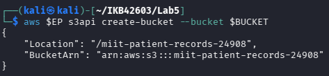
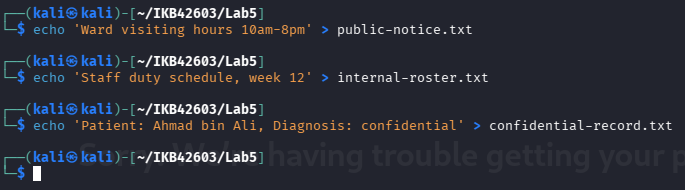
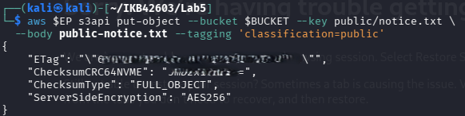
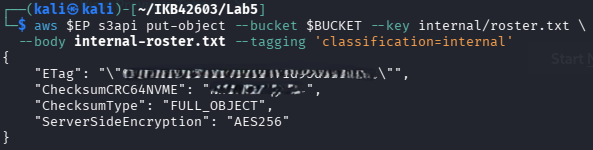
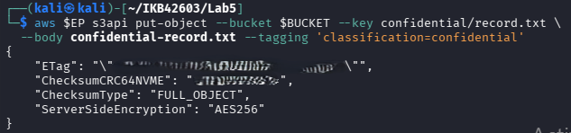
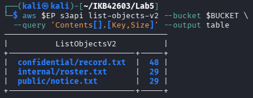

---

## Task 3 — Remediate with Block Public Access

The offending policy was removed and Block Public Access was applied as a preventative guardrail to stop any future accidental re-exposure.

```bash
# 1. Remove the offending policy
aws $EP s3api delete-bucket-policy --bucket $BUCKET

# 2. Apply Block Public Access guardrail
aws $EP s3api put-public-access-block --bucket $BUCKET \
  --public-access-block-configuration \
  BlockPublicAcls=true,IgnorePublicAcls=true,BlockPublicPolicy=true,RestrictPublicBuckets=true

aws $EP s3api get-public-access-block --bucket $BUCKET

# 3. Attempt to re-introduce the public policy
aws $EP s3api put-bucket-policy --bucket $BUCKET --policy file://public-policy.json

# 4. Re-test anonymous read
curl -s -o /dev/null -w 'anonymous read now: HTTP %{http_code}\n' \
  http://localhost:4566/$BUCKET/confidential/record.txt
```

**Result:** All four Block Public Access flags were confirmed `true`. On real AWS, `BlockPublicPolicy=true` would have rejected the re-applied public policy at write time. `RestrictPublicBuckets=true` would have blocked the anonymous read even if the policy slipped through. A preventative guardrail is stronger than a detective control because it stops the misconfiguration from taking effect rather than merely reporting it after the fact.

The least-privilege replacement policy was then applied, granting read access only to the account root scoped to the `internal/` prefix:

```bash
cat > least-privilege-policy.json <<JSON
{
  "Version": "2012-10-17",
  "Statement": [{
    "Sid": "AccountReadInternalOnly",
    "Effect": "Allow",
    "Principal": {"AWS": "arn:aws:iam::000000000000:root"},
    "Action": "s3:GetObject",
    "Resource": "arn:aws:s3:::[REDACTED]/internal/*"
  }]
}
JSON

aws $EP s3api put-bucket-policy --bucket $BUCKET \
  --policy file://least-privilege-policy.json
aws $EP s3api get-bucket-policy --bucket $BUCKET --query Policy --output text
```

**Evidence:**

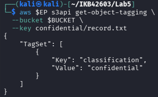
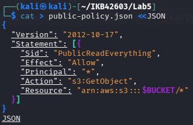
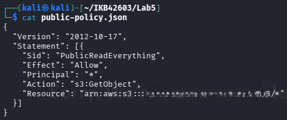
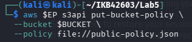
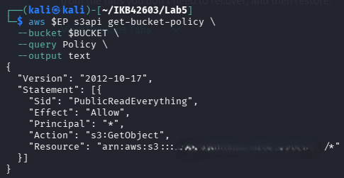

---

## Task 4 — Identity Policy vs Resource Policy

An IAM user `DataAnalyst` was created with a permissive identity policy allowing `s3:GetObject` and `s3:ListBucket` on all resources (`"*"`). A bucket policy was then applied with an explicit `Deny` on the `confidential/` prefix for that user.

```bash
aws $EP iam create-user --user-name DataAnalyst

cat > analyst-iam.json <<'JSON'
{
  "Version": "2012-10-17",
  "Statement": [{
    "Effect": "Allow",
    "Action": ["s3:GetObject", "s3:ListBucket"],
    "Resource": "*"
  }]
}
JSON

aws $EP iam put-user-policy --user-name DataAnalyst \
  --policy-name S3ReadAll \
  --policy-document file://analyst-iam.json

aws $EP iam create-access-key --user-name DataAnalyst \
  --query 'AccessKey.[AccessKeyId,SecretAccessKey]' --output text

aws configure --profile analyst set aws_access_key_id "[REDACTED]"
aws configure --profile analyst set aws_secret_access_key "[REDACTED]"
aws configure --profile analyst set region us-east-1
```

The bucket policy applied an explicit `Allow` on `internal/*` and an explicit `Deny` on `confidential/*` for the analyst:

```bash
cat > deny-confidential.json <<JSON
{
  "Version": "2012-10-17",
  "Statement": [
    {
      "Sid": "AllowAnalystInternal",
      "Effect": "Allow",
      "Principal": {"AWS": "arn:aws:iam::000000000000:user/DataAnalyst"},
      "Action": "s3:GetObject",
      "Resource": "arn:aws:s3:::[REDACTED]/internal/*"
    },
    {
      "Sid": "DenyAnalystConfidential",
      "Effect": "Deny",
      "Principal": {"AWS": "arn:aws:iam::000000000000:user/DataAnalyst"},
      "Action": "s3:*",
      "Resource": "arn:aws:s3:::[REDACTED]/confidential/*"
    }
  ]
}
JSON

aws $EP s3api put-bucket-policy --bucket $BUCKET --policy file://deny-confidential.json

# Should SUCCEED — allowed by both policies
AWS_PROFILE=analyst aws $EP s3api get-object \
  --bucket $BUCKET --key internal/roster.txt analyst-internal.txt \
  && echo "internal: ALLOWED"

# Should FAIL — IAM allows, bucket policy explicitly denies
AWS_PROFILE=analyst aws $EP s3api get-object \
  --bucket $BUCKET --key confidential/record.txt analyst-conf.txt \
  || echo "confidential: DENIED"
```

**Result:** `internal: ALLOWED` — both the IAM policy and the bucket policy's `AllowAnalystInternal` statement permit the request. `confidential: DENIED` — the bucket policy's explicit `Deny` on `DenyAnalystConfidential` overrides the IAM allow. An explicit Deny always wins in AWS policy evaluation regardless of any Allow.

```bash
# Clean up before Session B
aws $EP s3api delete-bucket-policy --bucket $BUCKET
```

**Evidence:**

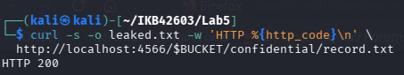

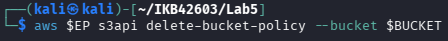
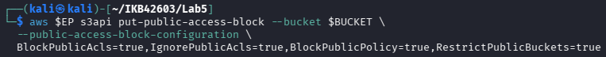
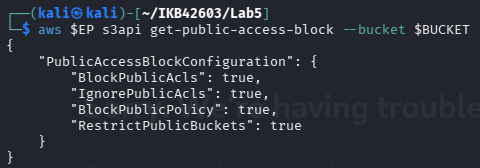
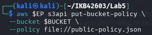
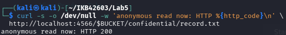

---

## Session B (Week 12) — Protecting, Retaining and Retiring Data

---

## Task 5 — Default Encryption at Rest (SSE-KMS)

A dedicated KMS key was created for the bucket. Default SSE-KMS encryption was then applied so that every uploaded object is encrypted automatically, regardless of whether the uploader specifies encryption flags.

```bash
export KEY_ID=$(aws $EP kms create-key \
  --description '[REDACTED] Lab6 patient records bucket key' \
  --query 'KeyMetadata.KeyId' --output text)
echo $KEY_ID

cat > encryption.json <<JSON
{
  "Rules": [{
    "ApplyServerSideEncryptionByDefault": {
      "SSEAlgorithm": "aws:kms",
      "KMSMasterKeyID": "$KEY_ID"
    },
    "BucketKeyEnabled": true
  }]
}
JSON

aws $EP s3api put-bucket-encryption --bucket $BUCKET \
  --server-side-encryption-configuration file://encryption.json
aws $EP s3api get-bucket-encryption --bucket $BUCKET

# Upload with NO encryption flags — bucket applies the key automatically
aws $EP s3api put-object --bucket $BUCKET \
  --key confidential/record-v2.txt --body confidential-record.txt
aws $EP s3api head-object --bucket $BUCKET --key confidential/record-v2.txt \
  --query '[ServerSideEncryption,SSEKMSKeyId,BucketKeyEnabled]' --output text
```

**Result:** `head-object` returned `aws:kms` and the KMS key ID, confirming the object was encrypted automatically by the bucket default. `BucketKeyEnabled: true` applies envelope encryption at bucket scale, reducing KMS API calls and cost without changing the confidentiality guarantee.

**Evidence:**

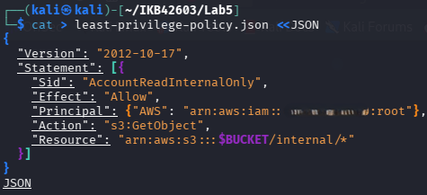
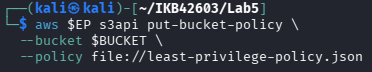
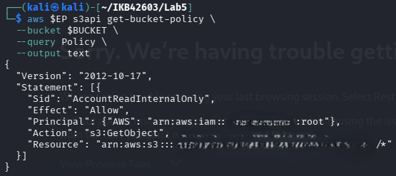
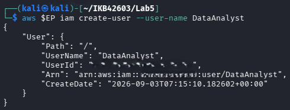

---

## Task 6 — Delegated Access and the Condition-Key Trap

A presigned URL was generated to provide time-bounded, credential-free access to a single object. The URL was tested before and after its 60-second expiry.

```bash
aws $EP s3 presign s3://$BUCKET/internal/roster.txt --expires-in 60

URL='[REDACTED]'
curl -s -w '<-- HTTP %{http_code}\n' "$URL"

sleep 65
curl -s -o /dev/null -w 'after expiry: HTTP %{http_code}\n' "$URL"
```

**Result:** Before expiry the file content was returned (`HTTP 200`). After expiry, the request was rejected. The presigned URL embeds `X-Amz-Algorithm`, `X-Amz-Credential`, `X-Amz-Date`, `X-Amz-Expires`, `X-Amz-SignedHeaders`, and `X-Amz-Signature`. Anyone holding the URL before it lapses is fully authorised — there is no identity check, only signature verification.

The `aws:SecureTransport` deny policy was then applied to demonstrate the condition-key trap:

```bash
cat > secure-transport.json <<JSON
{
  "Version": "2012-10-17",
  "Statement": [{
    "Sid": "DenyUnencryptedTransport",
    "Effect": "Deny",
    "Principal": "*",
    "Action": "s3:*",
    "Resource": ["arn:aws:s3:::[REDACTED]", "arn:aws:s3:::[REDACTED]/*"],
    "Condition": {"Bool": {"aws:SecureTransport": "false"}}
  }]
}
JSON

aws $EP s3api put-bucket-policy --bucket $BUCKET \
  --policy file://secure-transport.json

# Any call — expect it to be refused
aws $EP s3api list-objects-v2 --bucket $BUCKET

# Recover
aws $EP s3api delete-bucket-policy --bucket $BUCKET
```

**Result:** Every subsequent command was refused because the LocalStack endpoint is `http://` (plain HTTP), so `aws:SecureTransport` evaluates to `false` for every request and the Deny matches all of them. On real AWS the endpoint is HTTPS and the condition only catches genuinely insecure callers. This demonstrates that condition keys must always be evaluated against the environment they will run in — a policy correct for production AWS can lock you out entirely on a local HTTP endpoint.

**Evidence:**

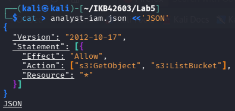
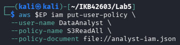
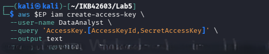
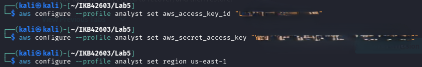
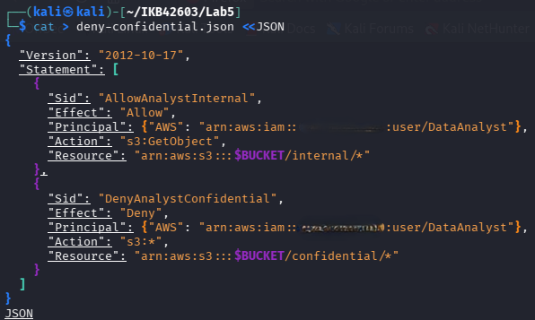
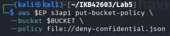
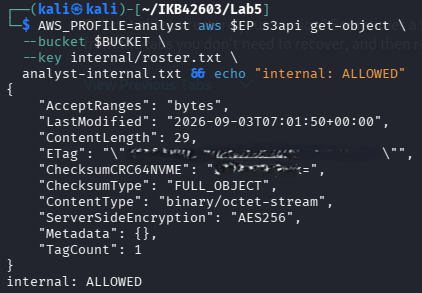
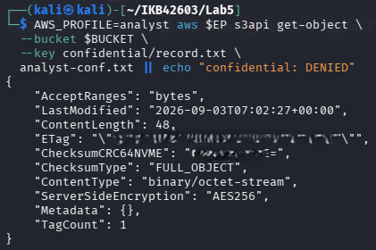

---

## Task 7 — Versioning, Delete Markers & Data Remanence

Versioning was enabled on the bucket. Two additional revisions of the confidential record were uploaded — the second using a redacted placeholder — and then a standard delete was performed to demonstrate that `delete-object` does not destroy data; it only places a delete marker.

```bash
aws $EP s3api put-bucket-versioning --bucket $BUCKET \
  --versioning-configuration Status=Enabled
aws $EP s3api get-bucket-versioning --bucket $BUCKET

echo 'Patient: [REDACTED], Diagnosis: [REDACTED]' > rec-v2.txt
echo 'Patient: [REDACTED], Diagnosis: [REDACTED]' > rec-v3.txt

aws $EP s3api put-object --bucket $BUCKET --key confidential/record.txt \
  --body rec-v2.txt --query VersionId --output text
aws $EP s3api put-object --bucket $BUCKET --key confidential/record.txt \
  --body rec-v3.txt --query VersionId --output text

aws $EP s3api list-object-versions --bucket $BUCKET \
  --prefix confidential/record.txt \
  --query 'Versions[].[VersionId,IsLatest,Size]' --output table

# 'Delete' the record
aws $EP s3api delete-object --bucket $BUCKET --key confidential/record.txt

# Delete marker is now the current version
aws $EP s3api list-object-versions --bucket $BUCKET \
  --prefix confidential/record.txt \
  --query 'DeleteMarkers[].[VersionId,IsLatest]' --output table

# Object appears gone to an ordinary reader
aws $EP s3api get-object --bucket $BUCKET \
  --key confidential/record.txt gone.txt

# But the original unredacted version is still there
aws $EP s3api get-object --bucket $BUCKET \
  --key confidential/record.txt --version-id null recovered.txt
cat recovered.txt
```

**Result:** `recovered.txt` still contained the original diagnosis. This is object-level data remanence — `delete-object` does not satisfy a data-subject erasure request under PDPA or GDPR. Every version must be deleted by explicit version ID:

```bash
aws $EP s3api delete-object --bucket $BUCKET \
  --key confidential/record.txt --version-id null
aws $EP s3api list-object-versions --bucket $BUCKET \
  --prefix confidential/record.txt \
  --query 'Versions[].[VersionId,Size]' --output table
```

**Evidence:**

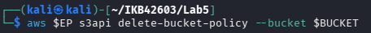
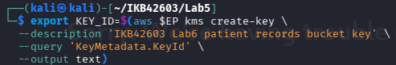

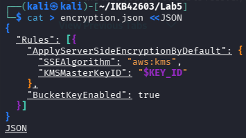
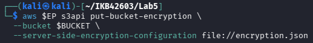
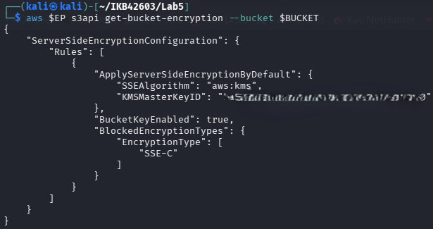
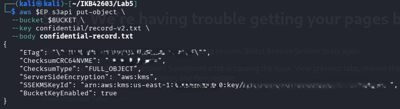
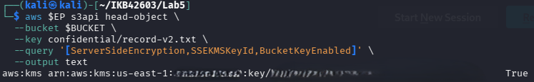
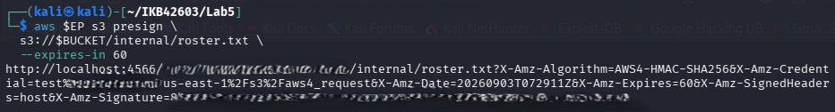
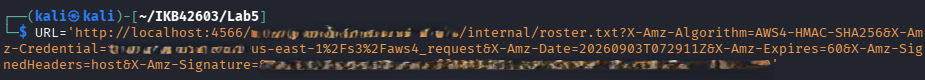
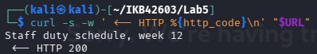
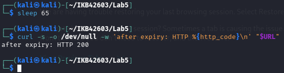
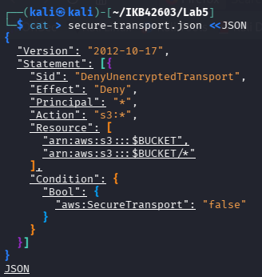
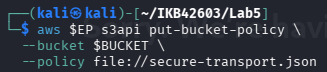
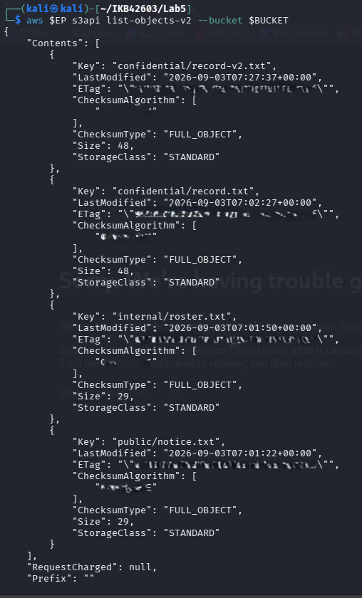
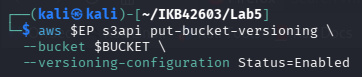
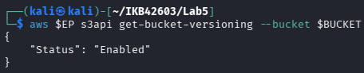
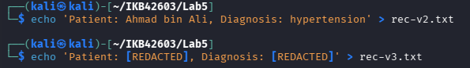
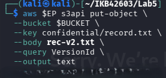
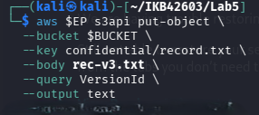


---

## Task 8 — Lifecycle, Retention & Cryptographic Erasure

A lifecycle configuration was applied to automate retention policy enforcement. The KMS key was then disabled and scheduled for deletion to achieve cryptographic erasure.

```bash
cat > lifecycle.json <<'JSON'
{
  "Rules": [
    {
      "ID": "RetireConfidentialRecords",
      "Filter": {"Prefix": "confidential/"},
      "Status": "Enabled",
      "Expiration": {"Days": 365},
      "NoncurrentVersionExpiration": {"NoncurrentDays": 30}
    },
    {
      "ID": "AbortIncompleteUploads",
      "Filter": {"Prefix": ""},
      "Status": "Enabled",
      "AbortIncompleteMultipartUpload": {"DaysAfterInitiation": 7}
    }
  ]
}
JSON

aws $EP s3api put-bucket-lifecycle-configuration --bucket $BUCKET \
  --lifecycle-configuration file://lifecycle.json
aws $EP s3api get-bucket-lifecycle-configuration --bucket $BUCKET \
  --query 'Rules[].[ID,Status]' --output table

# Cryptographic erasure — destroy the key
aws $EP kms describe-key --key-id $KEY_ID \
  --query 'KeyMetadata.[KeyId,KeyState,Enabled]' --output text
aws $EP kms disable-key --key-id $KEY_ID
aws $EP kms schedule-key-deletion --key-id $KEY_ID --pending-window-in-days 7
aws $EP kms describe-key --key-id $KEY_ID \
  --query 'KeyMetadata.[KeyState,DeletionDate]' --output text

# Attempt to read an object encrypted under the now-disabled key
aws $EP s3api get-object --bucket $BUCKET \
  --key confidential/record-v2.txt after-erasure.txt
```

**Result:** The lifecycle rules `RetireConfidentialRecords` and `AbortIncompleteUploads` were confirmed `Enabled`. The KMS key state moved to `PendingDeletion`. Once the key is destroyed, every object encrypted under it becomes unrecoverable ciphertext regardless of how many copies, versions, or backups exist — cryptographic erasure gives an auditor a stronger assurance than overwriting because it does not depend on controlling the physical media.

**Evidence:**


---

## Deliverables & Assessment

---

### 1. Screenshots

All screenshots are labelled and included in the Evidence sections of each task above (images `1lab6.png` through `69lab6.png`).

---

### 2. Data Classification Table

| Classification | Who may read it | Impact if leaked | Control applied |
|---|---|---|---|
| public | Anyone | Minimal — intended for public visibility | No access restriction; objects stored under `public/` prefix |
| internal | Authenticated account users only | Moderate — operational data exposed | Least-privilege bucket policy; read access scoped to `internal/*` for account root only |
| confidential | Authorised personnel only | High — patient PHI, regulatory breach (PDPA/GDPR) | Explicit Deny bucket policy on `confidential/*`; SSE-KMS default encryption; versioning with per-version deletion |

---

### 3. Short-Answer Questions

**Q1. Which single element of the Task 2 policy caused the exposure, and why is `Principal: "*"` more dangerous on a bucket policy than an over-broad IAM policy attached to one user?**

- `"Principal": "*"` caused the exposure.
- Grants access to everyone, including unauthenticated users.
- IAM over-broad policy affects only one identity.
- Bucket `Principal: "*"` affects the entire internet simultaneously.

---

**Q2. Explain the difference between an identity-based policy and a resource-based policy. In Task 4, which one decided each of the analyst's two requests?**

- Identity-based: attached to a user/role; defines what they can do.
- Resource-based: attached to the resource; defines who can access it.
- `internal/roster.txt` — decided by both policies agreeing to Allow.
- `confidential/record.txt` — decided by the bucket's explicit Deny.

---

**Q3. Block Public Access is described as a guardrail rather than a control. What is the difference, and why does the distinction matter for an organisation with many engineers?**

- Control: directly enforces one specific rule on one resource.
- Guardrail: prevents an entire class of misconfiguration organisation-wide.
- Guardrail stops careless engineers from ever creating public buckets.
- One guardrail covers all buckets; controls must be applied per bucket.

---

**Q4. Your bucket has default SSE-KMS encryption. Does that protect the confidential record from the analyst in Task 4?**

- No — SSE-KMS does not protect against authorised API access.
- Encryption protects data at rest on disk from physical/provider access.
- The analyst accesses via S3 API; AWS decrypts transparently on retrieval.
- Access control policies (Deny statement) are what stopped the analyst.

---

**Q5. A patient invokes their right to erasure. Using your Task 7 evidence, explain why `delete-object` alone is not compliant, and describe two mechanisms that would make the deletion provable.**

- `delete-object` creates a delete marker; all prior versions remain intact.
- `recovered.txt` proved the original diagnosis was still retrievable.
- Mechanism 1: Delete every version explicitly by version ID.
- Mechanism 2: Cryptographic erasure — destroy the KMS key; ciphertext is unrecoverable.

---

### 4. Verification Command Output

```text
=== [REDACTED] Lab 6 verification: miit-patient-records-[REDACTED] ===
True    True    True    True
Enabled
aws:kms [REDACTED]
RetireConfidentialRecords       Enabled
AbortIncompleteUploads  Enabled
PendingDeletion
```

**Evidence:**


---

## Security Best-Practices Checklist

- [x] Every object carries a classification tag before any access decision is made.
- [x] No bucket policy names `Principal: "*"`; anonymous access was tested and is refused.
- [x] Block Public Access is enabled on all four flags.
- [x] Access is granted by least privilege and scoped to a key prefix, never to `/*` by default.
- [x] Default encryption at rest is `aws:kms` with a customer-managed key.
- [x] Sharing uses time-bounded presigned URLs, not permanent public objects.
- [x] Versioning is enabled, and the team understands that delete markers do not destroy data.
- [x] A lifecycle configuration expresses the retention policy, and cryptographic erasure is available for provable deletion.

---

## Conclusion

This lab traced the full data security lifecycle for object storage — from classification and exposure through remediation, encryption, access control, versioning, and provable deletion. The key lessons are: `Principal: "*"` is the single most dangerous misconfiguration in object storage; Block Public Access is an organisation-wide guardrail that removes entire classes of risk; SSE-KMS protects data from physical and provider-level threats but not from authorised API callers; and `delete-object` is not erasure — cryptographic erasure via KMS key deletion is the only mechanism that gives an auditor provable, media-independent assurance of data destruction.

---

## References

- Course lectures — Week 4 (Data Protection); Week 10 (Policy, Compliance & Risk); Week 11 (Compliance Assessment & Reporting).
- Amazon S3 security best practices — https://docs.aws.amazon.com/AmazonS3/latest/userguide/security-best-practices.html
- Amazon S3 versioning and lifecycle — https://docs.aws.amazon.com/AmazonS3/latest/userguide/Versioning.html
- LocalStack S3 coverage and limitations — https://docs.localstack.cloud/references/coverage
- CSA Security Guidance v5 — Domain 5, Data Security; and the Data Security Lifecycle.
- MCMC MTSFB TC G017:2021 — Information Security Requirements for Cloud Service Providers (data handling clauses).
