# LAB 1: Cloud Account Security, Identity & Access Management

**Name:** Muhammad Asyraf bin Aznan

**Student ID:** 52215124467

**Subject:** Cloud Computing Security Essentials

**Code:** IKB 42603

**Date:** 9 August 2026

---

## Purpose

This report documents the hands-on implementation of cloud account security and Identity and Access Management (IAM) concepts using LocalStack (a local AWS emulator) and a local Kubernetes cluster managed by `kind`. The lab covers IAM group and user management, policy attachment, access key lifecycle management, and Kubernetes RBAC through Roles, RoleBindings, and ServiceAccounts.

## Requirements

- Kali Linux (or equivalent Linux environment) with Docker installed
- LocalStack running as a Docker container on port `4566`
- AWS CLI configured to target LocalStack
- `kind` and `kubectl` installed for local Kubernetes cluster management

---

## Part 1: AWS IAM with LocalStack

### Step 1: Verify Environment

Before beginning the IAM tasks, the environment was verified. Docker was confirmed to be installed and running on Kali Linux.

```text
$ docker --version
Docker version 2*.*.*, build e9*****
```

The operating system was also confirmed:

```text
$ more /etc/os-release
PRETTY_NAME="Kali GNU/Linux Rolling"
NAME="Kali GNU/Linux"
VERSION_ID="2026.2"
VERSION="2026.2"
VERSION_CODENAME=kali-rolling
ID=kali
ID_LIKE=debian
```

**Evidence:**

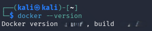
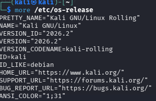

---

### Step 2: Start LocalStack and Verify Health

LocalStack was confirmed to be running. The health endpoint was checked to ensure all AWS-compatible services were available:

```text
$ curl http://localhost:4566/_localstack/health
```

The output confirmed all services — including `acm`, `apigateway`, `cloudformation`, `cloudwatch`, `config`, `dynamodb`, `ec2`, `iam`, `kms`, `lambda`, `logs`, `opensearch`, `redshift`, `route53`, `s3`, `s3control`, `ses`, `sns`, `sqs`, `sts`, `support`, `swf`, `transcribe` — all reporting `"available"`, with edition `"community"` and version `"3.8.1"`.

**Evidence:**

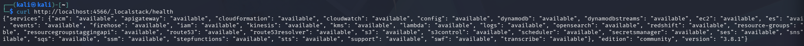

---

### Step 3: Configure AWS CLI for LocalStack

The AWS CLI endpoint was pointed to LocalStack and the caller identity was verified using STS to confirm the connection was working:

```text
$ aws --endpoint-url=http://localhost:4566 sts get-caller-identity
{
    "UserId": "*---------------*",
    "Account": "000000000000",
    "Arn": "arn:aws:iam::000000000000:root"
}
```

A shell variable was set to avoid repeating the endpoint flag in every command:

```text
$ EP="--endpoint-url=http://localhost:4566"
```

**Result:** The AWS CLI is correctly configured to communicate with LocalStack. The STS identity response confirms the local endpoint is reachable and functioning.

**Evidence:**

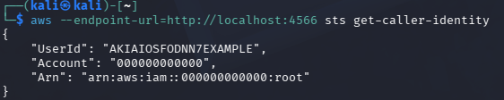
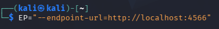

---

### Step 4: Create IAM Group and Attach Policy

An IAM group named `Admins` was created to centralise administrative permissions:

```text
$ aws $EP iam create-group --group-name Admins
{
    "Group": {
        "Path": "/",
        "GroupName": "******",
        "GroupId": "-----------------",
        "Arn": "arn:aws:iam::000000000000:group/Admins",
        "CreateDate": "2026-08-06T09:43:05.327000+00:00"
    }
}
```

The `AdministratorAccess` managed policy was then attached to the `Admins` group:

```text
$ aws $EP iam attach-group-policy \
--group-name Admins \
--policy-arn arn:aws:iam::aws:policy/AdministratorAccess
```

**Result:** The `Admins` group was created successfully and the `AdministratorAccess` policy was attached to it, granting full administrative permissions to any user who becomes a member of this group.

**Evidence:**

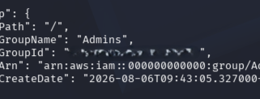
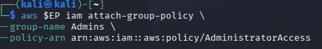

---

### Step 5: Create Admin User and Add to Group

An IAM user named `*******_*****` was created to represent an administrator:

```text
$ aws $EP iam create-user --user-name *******_*****
{
    "User": {
        "Path": "/",
        "UserName": "*******_*****",
        "UserId": "-------------------",
        "Arn": "arn:aws:iam::000000000000:user/*******_*****",
        "CreateDate": "2026-08-06T09:44:23.301000+00:00"
    }
}
```

The user was then added to the `Admins` group to inherit its `AdministratorAccess` policy:

```text
$ aws $EP iam add-user-to-group \
--group-name Admins \
--user-name *******_*****
```

**Result:** `*******_*****` was created and added to the `Admins` group. The user now inherits full administrative access through the group policy.

**Evidence:**

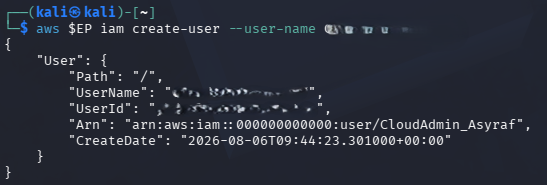
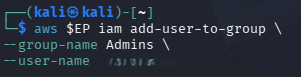

---

### Step 6: Create Analyst User and Attach Least-Privilege Policy

A second IAM group named `Admins` creation was re-confirmed, and a separate IAM user named `*******_*****` was created to represent a read-only analyst role:

```text
$ aws $EP iam create-user --user-name *******_*****
{
    "User": {
        "Path": "/",
        "UserName": "*******_*****",
        "UserId": "************",
        "Arn": "arn:aws:iam::000000000000:user/*******_*****",
        "CreateDate": "2026-08-06T09:50:52.688000+00:00"
    }
}
```

Following the principle of least privilege, the `AmazonS3ReadOnlyAccess` policy was attached directly to the `*******_*****` user:

```text
$ aws $EP iam attach-user-policy \
--user-name *******_***** \
--policy-arn arn:aws:iam::aws:policy/AmazonS3ReadOnlyAccess
```

The attached policies were verified:

```text
$ aws $EP iam list-attached-user-policies \
--user-name *******_*****
{
    "AttachedPolicies": [
        {
            "PolicyName": "AmazonS3ReadOnlyAccess",
            "PolicyArn": "arn:aws:iam::aws:policy/AmazonS3ReadOnlyAccess"
        }
    ]
}
```

**Result:** `*******_*****` was created with only S3 read-only access, demonstrating the principle of least privilege. The policy listing confirms only the intended policy is attached.

**Evidence:**

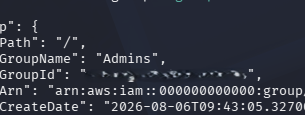
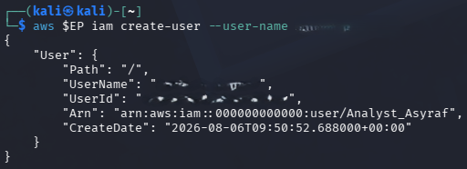
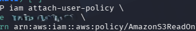
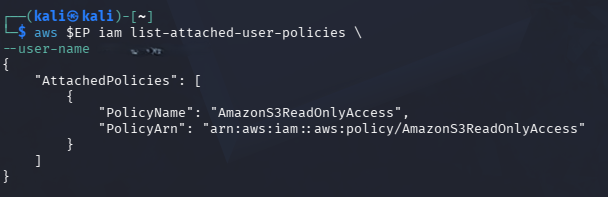

---

### Step 7: Access Key Lifecycle Management

The access key lifecycle for `Analyst_Asyraf` was demonstrated — listing, creating, and then deactivating an access key.

First, existing access keys were listed (none existed initially):

```text
$ aws $EP iam list-access-keys \
--user-name *******_*****
{
    "AccessKeyMetadata": []
}
```

A new access key was then created for the user:

```text
$ aws $EP iam create-access-key --user-name *******_*****
"AccessKey": {
    "UserName": "*******_*****",
    "AccessKeyId": "...",
    "Status": "Active",
    "SecretAccessKey": "...",
    "CreateDate": "2026-08-06T09:58:25+00:00"
}
```

Finally, the access key was deactivated to simulate a key rotation or security response:

```text
$ aws $EP iam update-access-key \
--user-name *******_***** \
--access-key-id <key-id> \
--status Inactive
```

**Result:** The full access key lifecycle was demonstrated — creation, active use, and deactivation. This practice is essential for credential hygiene and responding to potential security incidents.

**Evidence:**

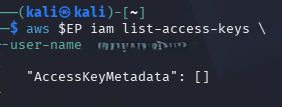
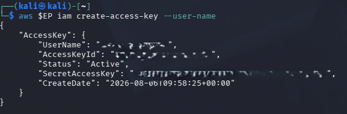
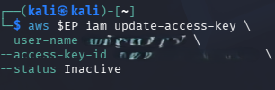

---

## Part 2: Kubernetes RBAC with kind

### Step 8: Create a Local Kubernetes Cluster

A local Kubernetes cluster named `ccse-lab1` was created using `kind`:

```text
$ kind create cluster --name ccse-lab1
Creating cluster "ccse-lab1" ...
 ✓ Ensuring node image (kindest/node: ...)
 ✓ Preparing nodes
 ✓ Writing configuration
 ✓ Starting control-plane
```

The cluster was verified using `kubectl`:

```text
$ kubectl cluster-info --context kind-ccse-lab1
Kubernetes control plane is running at https://127.0.0.1:41759
CoreDNS is running at https://127.0.0.1:41759/api/v1/namespaces/kube-system/services/kube-dns:dns/proxy

NAME                       STATUS   ROLES          AGE   VERSION
ccse-lab1-control-plane    Ready    control-plane  13m   v1.30.0
```

**Result:** A single-node local Kubernetes cluster `ccse-lab1` is running with the control plane at `https://127.0.0.1:41759`.

**Evidence:**

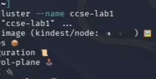
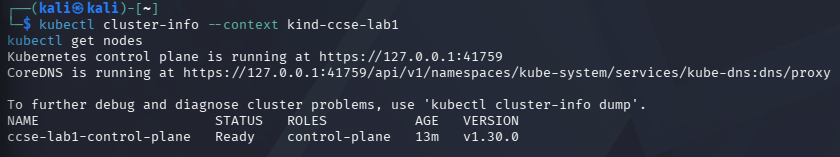

---

### Step 9: Create Namespaces

Two namespaces were created to simulate isolated environments — `dev` for development and `prod` for production:

```text
$ kubectl create namespace dev
namespace/dev created

$ kubectl create namespace prod
namespace/prod created

$ kubectl get namespaces
NAME               STATUS   AGE
default            Active   16m
dev                Active   0s
kube-node-lease    Active   16m
kube-public        Active   16m
kube-system        Active   16m
local-path-storage Active   16m
prod               Active   0s
```

**Result:** Both `dev` and `prod` namespaces are active and ready for scoped resource deployment and access control.

**Evidence:**

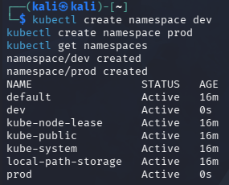

---

### Step 10: Create a ServiceAccount

A ServiceAccount named `dev-user` was created in the `dev` namespace to represent a workload identity:

```text
$ kubectl create serviceaccount dev-user -n dev
serviceaccount/dev-user created
```

**Result:** The `dev-user` ServiceAccount is created in the `dev` namespace. This identity will be used to test RBAC permission boundaries.

**Evidence:**

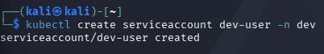

---

### Step 11: Create a Role

A Role named `pod-reader` was created in the `dev` namespace, granting only `get`, `list`, and `watch` verbs on `pods`:

```text
$ kubectl create role pod-reader -n dev \
--verb=get,list,watch \
--resource=pods
role.rbac.authorization.k8s.io/pod-reader created
```

**Result:** The `pod-reader` Role defines the minimum necessary permissions — read-only access to pods — scoped strictly to the `dev` namespace.

**Evidence:**

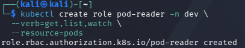

---

### Step 12: Create a RoleBinding

A RoleBinding named `dev-user-binding` was created to bind the `pod-reader` Role to the `dev-user` ServiceAccount in the `dev` namespace:

```text
$ kubectl create rolebinding dev-user-binding -n dev \
--role=pod-reader \
--serviceaccount=dev:dev-user
rolebinding.rbac.authorization.k8s.io/dev-user-binding created
```

**Result:** The `dev-user` ServiceAccount is now bound to the `pod-reader` Role through `dev-user-binding`, granting it read-only pod access within the `dev` namespace only.

**Evidence:**

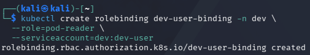

---

### Step 13: Verify RBAC Permissions

The `kubectl auth can-i` command was used to verify the effective permissions of the `dev-user` ServiceAccount.

**Can list pods in `dev`? → Yes (expected — allowed by RoleBinding):**

```text
$ kubectl auth can-i list pods -n dev --as=$SA
yes
```

**Can delete pods in `dev`? → No (expected — not granted by the Role):**

```text
$ kubectl auth can-i delete pods -n dev --as=$SA
no
```

**Can list pods in `prod`? → No (expected — RoleBinding is scoped to `dev` only):**

```text
$ kubectl auth can-i list pods -n prod --as=$SA
no
```

**Result:** The permission checks confirm that `dev-user` can only list pods in `dev`, and cannot perform any operations in `prod` or perform destructive actions like delete. This validates the least-privilege RBAC configuration.

**Evidence:**

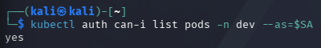
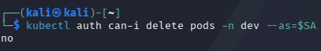
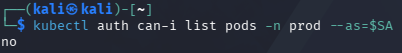

---

### Step 14: Inspect the RoleBinding

The full YAML definition of the `dev-user-binding` RoleBinding was retrieved to confirm its configuration:

```text
$ kubectl get rolebinding dev-user-binding -n dev -o yaml
apiVersion: rbac.authorization.k8s.io/v1
kind: RoleBinding
metadata:
  creationTimestamp: "2026-08-06T11:22:26Z"
  name: dev-user-binding
  namespace: dev
  resourceVersion: "1977"
  uid: [redacted]
roleRef:
  apiGroup: rbac.authorization.k8s.io
  kind: Role
  name: pod-reader
subjects:
- kind: ServiceAccount
  name: dev-user
  namespace: dev
```

**Result:** The YAML output confirms that `dev-user-binding` correctly references the `pod-reader` Role and binds it to the `dev-user` ServiceAccount in the `dev` namespace.

**Evidence:**

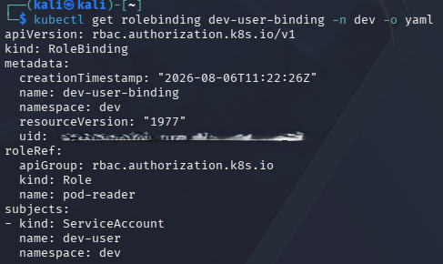

---

## Conclusion

| Task | Component | Outcome |
|---|---|---|
| Verify environment | Docker, Kali Linux, LocalStack | Confirmed operational |
| Configure AWS CLI | LocalStack endpoint | Configured and verified |
| Create IAM group | `Admins` + `AdministratorAccess` | Created and policy attached |
| Create admin user | `*******_*****` | Created and added to `Admins` group |
| Create analyst user | `*******_*****` | Created with `AmazonS3ReadOnlyAccess` only |
| Access key lifecycle | `*******_*****` key | Created and deactivated |
| Create Kubernetes cluster | `ccse-lab1` (kind) | Running, node Ready |
| Create namespaces | `dev`, `prod` | Both Active |
| Create ServiceAccount | `dev-user` in `dev` | Created |
| Create Role | `pod-reader` in `dev` | Created with read-only pod access |
| Create RoleBinding | `dev-user-binding` | Bound `pod-reader` to `dev-user` |
| Verify RBAC | `auth can-i` checks | Permissions behave as expected |

All IAM and RBAC objectives were completed successfully. The lab demonstrates how both AWS IAM and Kubernetes RBAC implement the principle of least privilege to minimise the blast radius of any potential account compromise.

---

## Short-Answer Questions

**1. Why is it better to attach policies to groups rather than individual users?**

Attaching policies to groups makes permission management more centralized, scalable, and auditable. Users can inherit permissions through group membership, so administrators can modify permissions for multiple users by changing the group's policy instead of managing each user individually.

---

**2. What is the difference between an IAM User and an IAM Role?**

An IAM User represents a permanent human or application identity with assigned permissions, while an IAM Role provides a temporary identity and permissions when needed. Roles help reduce the need for long-lived credentials.

---

**3. How does the principle of least privilege apply to the Analyst account, and what is the security benefit?**

Least privilege means giving users only the permissions required for their tasks. The Analyst account is given only S3 read-only permissions instead of administrative privileges. If the account were compromised, the attacker would have a much smaller range of actions available, reducing the potential damage or blast radius.

---

**4. What is the difference between a Role and a RoleBinding in Kubernetes RBAC?**

A Role defines the permissions that are allowed, while a RoleBinding assigns those permissions to a particular user, group, or ServiceAccount. In this lab, `pod-reader` defines the allowed Pod operations and `dev-user-binding` gives those permissions to the `dev-user` ServiceAccount.

---

**5. Why could the `dev-user` ServiceAccount not access the `prod` namespace, and what security principle does this demonstrate?**

The `dev-user` ServiceAccount could not access `prod` because its RoleBinding is limited to the `dev` namespace. Its permissions therefore do not extend to the production namespace. This demonstrates the principle of least privilege by restricting the developer to only the resources and environment required for their work.
