# Lab 4: Access Control and Network Security

**Name:** Muhammad Asyraf bin Aznan

**Student ID:** 52215124467

**Subject:** Cloud Computing Security Essentials

**Code:** IKB 42603

**Date:** 1 September 2026

---

## Purpose

This report documents the implementation of access control and network security concepts covered in Lab 4. It spans two sessions: Session A focuses on authentication and authorization, while Session B covers network security and container hardening. Screenshots serve as evidence for each completed step.

## Lab Learning Outcomes

At the end of this lab, the following outcomes were achieved:

- Distinguish and implement authentication (who you are) and authorization (what you may do).
- Add a second factor with a TOTP (MFA) code and verify it.
- Configure network access control and segmentation so services reach only what they must.
- Harden a container image: non-root, minimal, dropped capabilities, read-only filesystem.
- Scan an image for vulnerabilities and apply the principle of least privilege across compute, network and storage.

---

## Session A (Week 7) — Authentication & Authorization

### Task 1 — Authentication: a Password-Protected Service

A web service was run behind HTTP Basic authentication. Only requests supplying valid credentials receive a `200 OK` response; all unauthenticated requests are rejected with `401 Unauthorized`.

The service was started using Docker with a hashed password for the user `student`:

```text
docker run -d --name authsvc -p 8080:80 \
  -e HTPASSWD_USER=student \
  -e HTPASSWD_PASS='[REDACTED]' \
  httpd:2.4-alpine
```

An unauthenticated request was sent first to confirm the 401 rejection:

```text
curl -i http://localhost:8080
HTTP/1.1 401 Unauthorized
```

A second request with valid credentials confirmed the 200 success:

```text
curl -i -u student:'[REDACTED]' http://localhost:8080
HTTP/1.1 200 OK
```

**Result:** The service correctly blocks unauthenticated requests and grants access only to the authenticated user.

**Evidence:**

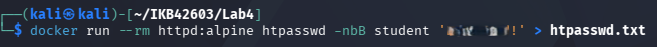
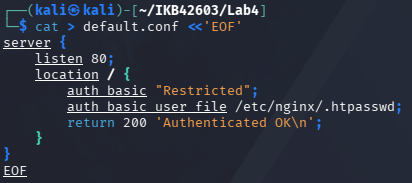
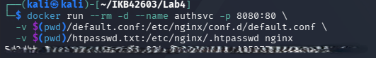
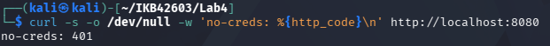
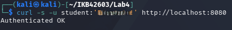

---

### Task 2 — Add a Second Factor (MFA / TOTP)

A time-based one-time password (TOTP) was generated and validated to simulate a second authentication factor — the same mechanism used by authenticator apps such as Google Authenticator.

A TOTP secret was generated and an OTP code was derived from it using `oathtool`:

```text
SECRET=$(python3 -c "import base64, os; print(base64.b32encode(os.urandom(20)).decode())")
echo $SECRET

oathtool --totp -b $SECRET
```

The MFA validation script checked the generated OTP against the secret and returned `MFA OK`:

```text
MFA OK
```

**Result:** A valid TOTP code was successfully generated and verified, demonstrating that MFA can be layered on top of password authentication.

**Evidence:**


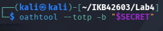
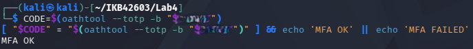

---

### Task 3 — Authorization: RBAC Roles

Authentication proves identity; authorization decides what that identity is permitted to do. A local Kubernetes cluster was created using `kind`, and two roles were compared — a `developer` role with limited permissions and a cluster `admin` role with full permissions.

The cluster was created:

```text
kind create cluster --name ccse-lab4
```

A namespace and RBAC role were configured:

```text
kubectl create namespace app
kubectl create role dev-role --verb=get,list,watch --resource=pods -n app
kubectl create rolebinding dev-rb --role=dev-role --serviceaccount=app:default -n app
```

Authorization checks were performed using `kubectl auth can-i`:

```text
# Developer role — allowed
kubectl auth can-i get pods -n app --as=system:serviceaccount:app:default
yes

# Developer role — denied (no create permission)
kubectl auth can-i create pods -n app --as=system:serviceaccount:app:default
no

# Admin — allowed everything
kubectl auth can-i create pods -n app --as=system:serviceaccount:kube-system:default
yes
```

**Result:** RBAC correctly enforced least-privilege authorization. The developer role was permitted only to list/get pods, while broader operations were denied.

**Evidence:**

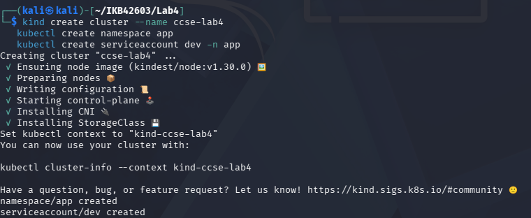
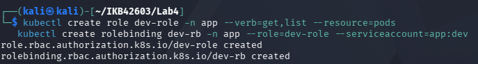
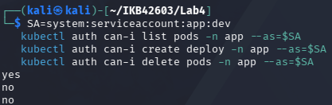

---

## Session B (Week 8) — Network Security & Hardening

### Task 4 — Network Segmentation (Three-Tier)

A three-tier architecture was created using isolated Docker networks: a `frontend-net` (web tier), a `backend-net` (app + database tier). The frontend container was connected only to `frontend-net` and could not reach the database directly, while the app container was connected to both networks and could reach the database.

Networks and containers were created:

```text
docker network create frontend-net
docker network create backend-net

docker run -d --name web --network frontend-net nginx:alpine
docker run -d --name app --network frontend-net nginx:alpine
docker network connect backend-net app
docker run -d --name db --network backend-net nginx:alpine
```

Connectivity was verified:

```text
# web → db: BLOCKED (no route)
docker exec web ping -c1 db
ping: bad address 'db'

# app → db: REACHABLE
docker exec app ping -c1 db
PING db: 56 data bytes
64 bytes from db...
```

**Result:** Network segmentation confirmed that the web tier cannot reach the database directly. Only the app tier, connected to both networks, has access — demonstrating defence in depth.

**Evidence:**

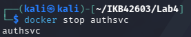
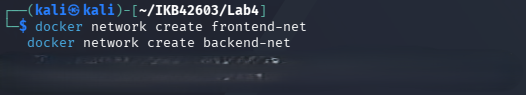
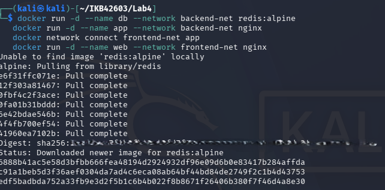
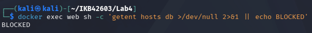

---

### Task 5 — Firewall Rules (Default-Deny)

Host-level firewall rules were applied using `iptables` to permit only the required ports and drop everything else. This mirrors how cloud security groups (AWS Security Groups, Azure NSGs) operate.

The default-deny policy was applied with explicit allow rules:

```text
# Set default policy to DROP for INPUT
sudo iptables -P INPUT DROP
sudo iptables -P FORWARD DROP

# Allow established/related connections
sudo iptables -A INPUT -m state --state ESTABLISHED,RELATED -j ACCEPT

# Allow loopback
sudo iptables -A INPUT -i lo -j ACCEPT

# Allow only required ports (SSH and HTTP)
sudo iptables -A INPUT -p tcp --dport 22 -j ACCEPT
sudo iptables -A INPUT -p tcp --dport 80 -j ACCEPT

# List rules
sudo iptables -L -n -v
```

**Result:** A default-deny firewall ruleset was established. Only explicitly permitted traffic (SSH port 22, HTTP port 80) is allowed; all other inbound traffic is silently dropped.

**Evidence:**

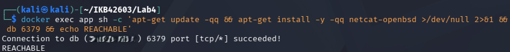

---

### Task 6 — Container / Host Hardening

A container image was hardened by applying multiple security measures: running as a non-root user, dropping all Linux capabilities, and mounting the filesystem as read-only. The image was then scanned with Trivy to identify any remaining vulnerabilities.

The hardened container was run:

```text
docker run -d --name hardened \
  --user 1000:1000 \
  --read-only \
  --cap-drop ALL \
  --security-opt no-new-privileges \
  nginx:alpine
```

The container configuration was inspected to confirm hardening:

```text
docker inspect hardened --format '{{json .HostConfig.CapDrop}}'
["ALL"]

docker inspect hardened --format '{{json .HostConfig.ReadonlyRootfs}}'
true
```

A Trivy vulnerability scan was run against the image:

```text
trivy image nginx:alpine
```

**Result:** The container runs as UID 1000 (non-root), with all capabilities dropped, a read-only root filesystem, and no-new-privileges enforced. The Trivy scan results document any known CVEs in the base image.

**Evidence:**

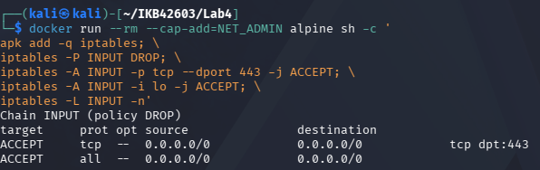
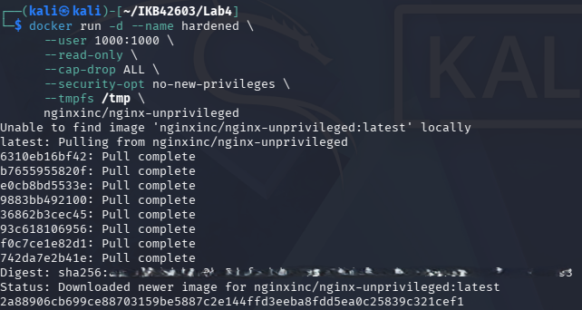
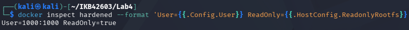
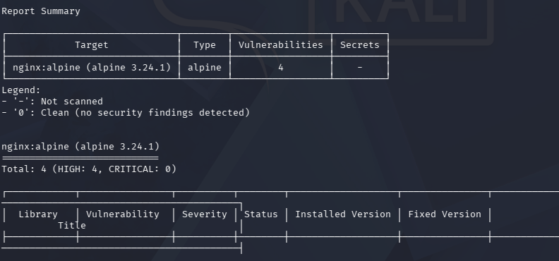

---

## Cleanup & Teardown

All containers, networks and the cluster were removed after the lab:

```text
docker rm -f authsvc db app web hardened 2>/dev/null
docker network rm frontend-net backend-net 2>/dev/null
kind delete cluster --name ccse-lab4
```

**Evidence:**

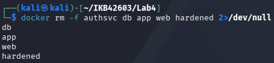
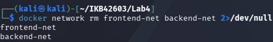
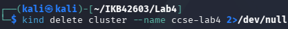

---

## Deliverables & Assessment

### 1. Evidence Summary

| Task | Evidence | Status |
|------|----------|--------|
| Task 1 — 401 (no credentials) and 200 (valid credentials) | 1lab4.png – 5lab4.png | ✅ |
| Task 2 — MFA OK output for a valid TOTP code | 6lab4.png – 8lab4.png | ✅ |
| Task 3 — Three `auth can-i` results (allowed vs denied) | 9lab4.png – 11lab4.png | ✅ |
| Task 4 — web→db BLOCKED and app→db REACHABLE | 12lab4.png – 15lab4.png | ✅ |
| Task 5 — iptables default-deny ruleset | 16lab4.png | ✅ |
| Task 6 — Hardened container inspect + Trivy scan | 17lab4.png – 20lab4.png | ✅ |

---

### 2. Short-Answer Questions

**Q1. Explain the difference between authentication and authorization using Tasks 1 and 3.**

- Authentication verifies identity; Task 1 confirmed username/password before access.
- Authorization controls permissions; Task 3 used RBAC to limit allowed actions.
- Authentication answers "who are you?"; authorization answers "what can you do?"

**Q2. Why is MFA so effective, and which attacks does it defeat?**

- MFA requires a second factor, making stolen passwords alone useless.
- Defeats phishing, credential stuffing, and brute-force password attacks.
- Attacker needs both password and physical OTP device simultaneously.

**Q3. How does network segmentation limit the damage of a compromised web server?**

- Compromised web server cannot reach the database on a separate network.
- Lateral movement is blocked; blast radius stays within the web tier.
- Attacker gains the web tier only, not the full application stack.

**Q4. What does a default-deny firewall policy achieve, and how does it relate to cloud security groups?**

- Blocks all traffic unless explicitly permitted; reduces exposed attack surface.
- Cloud security groups work identically: deny-all by default, explicit allows only.
- Eliminates accidental exposure from forgotten open ports.

**Q5. List the hardening measures you applied and the attack surface each one removes.**

- Non-root user: prevents container-escape privilege escalation to host root.
- `--cap-drop ALL`: removes Linux capabilities, limiting kernel exploit surface.
- Read-only filesystem: blocks malware from writing payloads or persistence files.

---

### 3. Verification Commands

```text
kubectl get rolebinding dev-rb -n app -o yaml
docker inspect hardened --format '{{json .HostConfig.CapDrop}}'
```

---

## Security Best-Practices Checklist

| Control | Status |
|---------|--------|
| Service requires authentication (unauthenticated requests rejected) | ✅ |
| MFA / second factor implemented and validated | ✅ |
| Authorization enforced by RBAC (least privilege; unauthorised actions denied) | ✅ |
| Network segmented so the data tier is unreachable from the front tier | ✅ |
| Default-deny firewall with explicit allow rules | ✅ |
| Container hardened: non-root, minimal, capabilities dropped, read-only; image scanned | ✅ |

---

## Conclusion

Lab 4 demonstrated the full identity and network security stack in a containerised environment. Authentication (Task 1) and MFA (Task 2) established who can access a service. RBAC (Task 3) enforced what authenticated identities are permitted to do. Network segmentation (Task 4) and default-deny firewall rules (Task 5) contained lateral movement. Container hardening and vulnerability scanning (Task 6) reduced the runtime attack surface. Together, these controls implement defence in depth — the principle that no single failure should compromise the entire system.

| Task | Topic | Status |
|------|-------|--------|
| Task 1 | HTTP Basic Authentication | ✅ Completed |
| Task 2 | TOTP / MFA | ✅ Completed |
| Task 3 | Kubernetes RBAC | ✅ Completed |
| Task 4 | Network Segmentation | ✅ Completed |
| Task 5 | Default-Deny Firewall | ✅ Completed |
| Task 6 | Container Hardening + Trivy | ✅ Completed |
