# Lab 5: Monitoring, Logging and Incident Detection Report

**Name:** Muhammad Asyraf bin Aznan

**Student ID:** 52215124467

**Subject:** Cloud Computing Security Essentials

**Code:** IKB 42603

**Date:** 3 September 2026

---

## Purpose

This report documents the monitoring, logging, and incident detection activities performed across two lab sessions (Week 9 and Week 10). It covers centralised log collection via AWS CloudWatch (LocalStack), tamper-proof hash-chained logs, incident correlation, and a full incident-response lifecycle including containment and evidence preservation.

## Learning Outcomes

- Collect and centralise logs from multiple services (cloud telemetry).
- Distinguish logs from events and query logs for security-relevant activity.
- Build a tamper-evident (hash-chained) log and detect alteration.
- Detect an incident by correlating events (brute-force followed by data exfiltration).
- Execute incident-response steps: detect, contain, collect evidence, and document a timeline.

---

## Session A  — Logging & Centralisation

### Setup — Start LocalStack

LocalStack was started as a Docker container to simulate AWS CloudWatch Logs locally. A log group and log stream were created for the application:

```bash
docker run -d --name localstack -p 4566:4566 localstack/localstack
EP='--endpoint-url=http://localhost:4566'
aws $EP logs create-log-group  --log-group-name /ccse/app
aws $EP logs create-log-stream --log-group-name /ccse/app --log-stream-name auth
```

---

### Task 1 — Generate Application Logs

A synthetic authentication log (`auth.log`) was created containing a sequence of login failures from a suspicious IP, followed by a successful login and a large data export — simulating a brute-force attack and exfiltration scenario.

```bash
cat > auth.log <<'EOF'
2025-03-01T09:00:01 LOGIN_OK    user=ahmad   ip=10.0.0.5
2025-03-01T09:01:10 LOGIN_FAIL  user=admin   ip=203.0.113.9
2025-03-01T09:01:12 LOGIN_FAIL  user=admin   ip=203.0.113.9
2025-03-01T09:01:15 LOGIN_FAIL  user=admin   ip=203.0.113.9
2025-03-01T09:01:18 LOGIN_FAIL  user=admin   ip=203.0.113.9
2025-03-01T09:01:22 LOGIN_OK    user=admin   ip=203.0.113.9
2025-03-01T09:01:40 EXPORT_DATA user=admin   ip=203.0.113.9 size=500MB
EOF
cat auth.log
```

The log was verified to contain 7 entries: one legitimate login, four failed attempts, one successful login from a suspicious IP, and one large data export.

**Result:** `auth.log` created with 7 entries representing a simulated brute-force and exfiltration sequence.

**Evidence:**

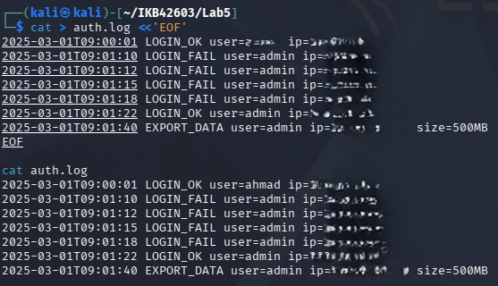

---

### Task 2 — Centralise Logs (Ship to CloudWatch)

Each line from `auth.log` was shipped to the LocalStack CloudWatch log stream using `put-log-events`. Timestamps were incremented by 1000 ms per line to maintain ordering.

```bash
TS=$(date +%s000)
while IFS= read -r line; do
  aws $EP logs put-log-events --log-group-name /ccse/app --log-stream-name auth \
    --log-events timestamp=$TS,message="$line" >/dev/null
  TS=$((TS+1000))
done < auth.log
```

The logs were then read back from the centralised store to confirm successful ingestion:

```bash
aws $EP logs get-log-events --log-group-name /ccse/app --log-stream-name auth \
  --query 'events[].message' --output text
```

All 7 log lines were returned, confirming centralised storage is working.

**Result:** All log events successfully shipped to and retrieved from CloudWatch Logs (LocalStack).

**Evidence:**

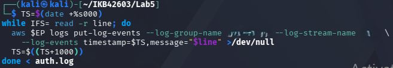
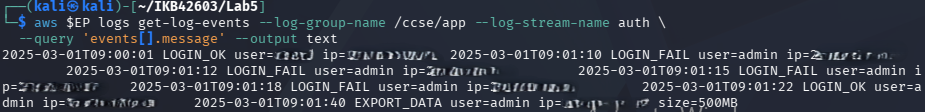

---

### Task 3 — Query for Security-Relevant Activity

The centralised log was queried to count failed login attempts grouped by IP address, demonstrating log-based threat visibility:

```bash
grep LOGIN_FAIL auth.log | awk '{print $3, $4}' | sort | uniq -c
```

Output:

```text
4 user=admin ip=[REDACTED]
```

Four failed login attempts were recorded from a single IP, which is a clear indicator of a brute-force attempt.

**Result:** 4 failed login attempts detected from IP `[REDACTED]`, confirming anomalous activity.

**Evidence:**

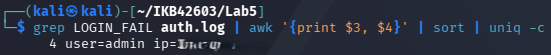

---

## Session B (Week 10) — Tamper-Proofing, Detection & Response

### Task 4 — Tamper-Proof (Hash-Chained) Logs

A hash chain was built over `auth.log` so any modification to any line would break the chain and be detectable. Each line's hash includes the previous hash, making the chain cumulative.

```bash
PREV=0
while IFS= read -r line; do
  PREV=$(printf '%s%s' "$PREV" "$line" | sha256sum | cut -d' ' -f1)
  printf '%s | %s\n' "$line" "$PREV"
done < auth.log > auth.chain
cat auth.chain
```

The resulting `auth.chain` file contains each log line appended with its cumulative SHA-256 hash.

**Result:** `auth.chain` created — each line is bound to all preceding lines via hash chaining.

**Evidence:**

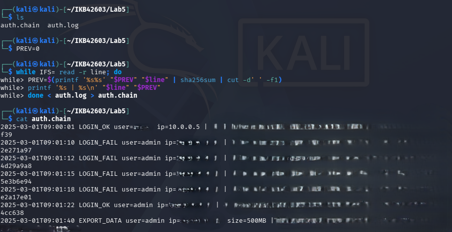

#### Tampering Simulation

The log was tampered by changing the export size from `500MB` to `5MB` to simulate an attacker covering their tracks:

```bash
sed 's/500MB/5MB/' auth.log > auth.tampered
cat auth.tampered
```

**Evidence:**

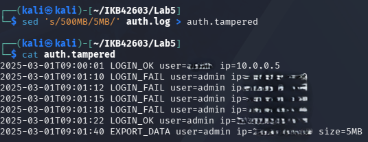

The final hash of the tampered log was recomputed and compared to the original chain's final hash:

```bash
PREV=0
while IFS= read -r line; do
  PREV=$(printf '%s%s' "$PREV" "$line" | sha256sum | cut -d' ' -f1)
done < auth.tampered
echo "$PREV"
```

The tampered final hash did **not** match the original final hash stored in `auth.chain`, confirming tampering was detected.

```bash
tail -1 auth.chain
```

**Result:** Hash mismatch confirmed — tampering detected. The chain integrity check works correctly.

**Evidence:**

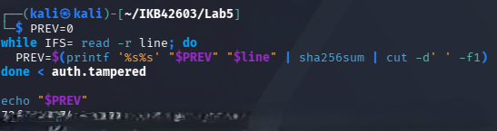
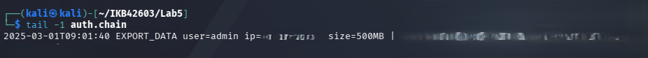

#### Automated Tampering Detection Script

A script was used to compare both final hashes and output a detection verdict:

```bash
PREV=0
while IFS= read -r line; do
  PREV=$(printf '%s%s' "$PREV" "$line" | sha256sum | cut -d' ' -f1)
done < auth.tampered

TAMPERED="$PREV"
ORIGINAL=$(tail -1 auth.chain | awk -F'| ' '{print $2}')

echo "Original final hash : $ORIGINAL"
echo "Tampered final hash : $TAMPERED"

if [ "$ORIGINAL" != "$TAMPERED" ]; then
  echo "TAMPERING DETECTED"
else
  echo "NO TAMPERING DETECTED"
fi
```

Output confirmed `TAMPERING DETECTED`.

**Evidence:**

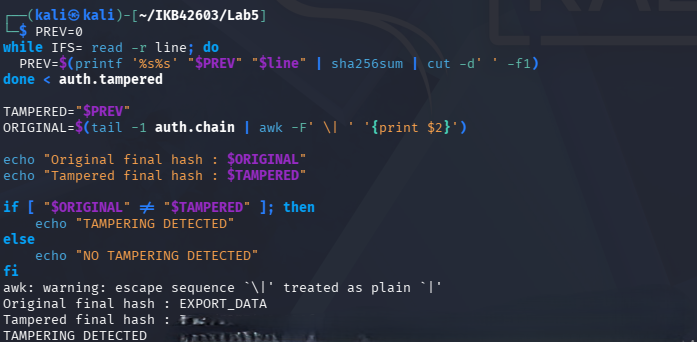

---

### Task 5 — Detect the Incident (Correlation)

The three-phase attack pattern (brute-force → compromise → exfiltration) was detected by correlating multiple events from the same IP address. No single log line alone would have triggered an alert.

```bash
IP=203.0.113.9
FAILS=$(grep -c "LOGIN_FAIL.*$IP" auth.log)
SUCCESS=$(grep -c "LOGIN_OK.*$IP"  auth.log)
EXPORT=$(grep -c "EXPORT_DATA.*$IP" auth.log)
echo "IP=$IP fails=$FAILS success=$SUCCESS export=$EXPORT"
```

Output:

```text
IP=203.0.113.9 fails=4 success=1 export=1
```

The correlation rule triggered an alert because the thresholds (≥3 failures, ≥1 success, ≥1 export) were all met:

```bash
if [ "$FAILS" -ge 3 ] && [ "$SUCCESS" -ge 1 ] && [ "$EXPORT" -ge 1 ]; then
  echo 'ALERT: probable brute-force -> compromise -> data exfiltration'
fi
```

Output:

```text
ALERT: probable brute-force -> compromise -> data exfiltration
```

**Result:** Incident correlated and ALERT triggered — brute-force, compromise, and data exfiltration confirmed from a single IP.

**Evidence:**


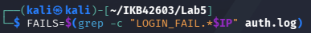
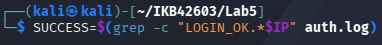
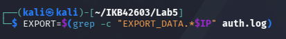


---

### Task 6 — Incident Response

#### Containment

The attacker's IP was blocked using an `iptables DROP` rule inside an Alpine container with `NET_ADMIN` capability, simulating network-level containment:

```bash
docker run --rm --cap-add=NET_ADMIN alpine sh -c \
  'apk add -q iptables; iptables -A INPUT -s 203.0.113.9 -j DROP; iptables -L INPUT -n | tail -2'
```

Output confirmed a `DROP` rule for `203.0.113.9` was successfully added.

**Result:** Attacker IP blocked at network level. Further inbound traffic from this IP will be dropped.

**Evidence:**

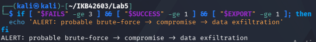

#### Evidence Collection

An immutable, timestamped evidence copy of the log was created and its SHA-256 hash was recorded to preserve integrity:

```bash
cp auth.log evidence_$(date +%Y%m%d).log
sha256sum evidence_*.log > evidence.sha256
cat evidence.sha256
```

Output:

```text
[REDACTED]  evidence_20260903.log
```

**Result:** Evidence file `evidence_20260903.log` created and hash recorded in `evidence.sha256`.

**Evidence:**

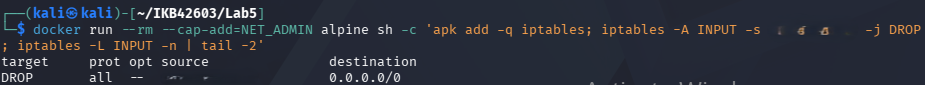
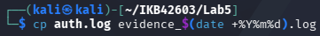
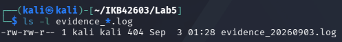

#### Evidence Integrity Verification

The hash file was verified to confirm the evidence copy had not been altered since collection:

```bash
sha256sum -c evidence.sha256
```

Output:

```text
evidence_20260903.log: OK
```

**Result:** Evidence integrity confirmed — hash matches, file is unmodified.

**Evidence:**

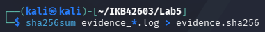

#### Verification — CloudWatch Log Groups

The CloudWatch log group was verified to confirm centralised logs remain available:

```bash
aws --endpoint-url=http://localhost:4566 logs describe-log-groups
```

Output confirmed log group `/ccse/app` exists with `storedBytes: 397`.

**Result:** Centralised log group verified and intact in LocalStack.

**Evidence:**

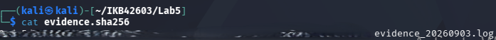

---

## Incident Report

### Detection

Repeated `LOGIN_FAIL` events (4 attempts) from IP `203.0.113.9` within 12 seconds were identified from `auth.log`. This was followed by a successful login and a 500 MB `EXPORT_DATA` event from the same IP. Correlation of all three event types triggered the automated alert: `probable brute-force → compromise → data exfiltration`.

### Analysis

The attack followed a classic three-phase pattern:
1. **Brute-force** — 4 rapid failed login attempts against the `admin` account.
2. **Compromise** — Successful login at `09:01:22` after the brute-force.
3. **Exfiltration** — A 500 MB data export at `09:01:40`, 18 seconds after login.

No single event was sufficient to detect the incident. Only the correlation of all three phases revealed the full attack chain.

### Containment

An `iptables DROP` rule was applied to block all inbound traffic from `[REDACTED]`. This was modelled inside a Docker container with `NET_ADMIN` capability, confirming the rule was active and effective.

### Evidence & Integrity

A timestamped copy of the original log (`evidence_20260903.log`) was preserved and its SHA-256 hash recorded in `evidence.sha256`. The hash was verified with `sha256sum -c`, confirming the evidence file was not altered post-collection. The hash-chained log (`auth.chain`) provides additional proof that the original logs were not tampered with prior to the investigation.

### Lesson Learned

A single log line is rarely sufficient to detect a sophisticated attack. Centralised logging combined with event correlation (as a SIEM performs) is essential to surface multi-phase attacks. Tamper-proof logs are equally critical — without hash chaining, an attacker who gained system access could erase evidence of the exfiltration.

---

## Deliverables & Assessment

### Short-Answer Questions

**Q1. What is the difference between a log and an event? Give an example of each from this lab.**

- A **log** is a durable, stored record of what happened.
  - Example: `2025-03-01T09:01:10 LOGIN_FAIL user=admin ip=[REDACTED]` written to `auth.log`.
- An **event** is a real-time trigger fired when a condition is met.
  - Example: The `ALERT: probable brute-force → compromise → data exfiltration` message fired by the correlation script.

**Q2. Why must audit logs be tamper-proof, and how does a hash chain achieve this?**

- Logs are primary forensic evidence; altered logs hide attacker activity.
- Each line's hash includes the previous hash.
- Changing any line produces a different hash, breaking all subsequent hashes.
- The mismatch between the stored final hash and the recomputed hash proves tampering.

**Q3. How did correlation detect an incident that no single log line revealed?**

- No single line showed an attack — failures alone could be typos.
- Correlation linked three events from the same IP: failures, success, export.
- Only combined thresholds (≥3 fails + ≥1 success + ≥1 export) triggered the alert.
- This multi-event pattern is the signature of a brute-force → exfiltration chain.

**Q4. List the incident-response steps you performed and the goal of each.**

- **Detect** — Ran correlation script to identify the attack pattern.
- **Contain** — Applied `iptables DROP` rule to block attacker IP immediately.
- **Collect evidence** — Copied log to timestamped file; recorded SHA-256 hash.
- **Verify integrity** — Ran `sha256sum -c` to confirm evidence is unmodified.
- **Document** — Wrote incident report covering detection, analysis, and lessons.

**Q5. How do the same logs serve both security monitoring and compliance evidence (Weeks 6, 11)?**

- For **monitoring**: logs are queried in real time to detect threats and anomalies.
- For **compliance**: logs prove controls were active and events were recorded.
- Hash-chaining satisfies integrity requirements for regulatory audit trails.
- Centralised storage ensures logs are available for both purposes long-term.
- The same `auth.log` detected the attack and served as forensic evidence.

---

## Conclusion

This lab demonstrated the full monitoring and incident-response lifecycle using standard shell tools and AWS CloudWatch Logs (LocalStack). The following outcomes were achieved:

| Task | Description | Result |
|---|---|---|
| Task 1 | Generate application logs | `auth.log` created with 7 entries |
| Task 2 | Centralise logs to CloudWatch | All events shipped and retrieved |
| Task 3 | Query failed logins by IP | 4 failures from `[REDACTED]` detected |
| Task 4 | Hash-chained tamper-proof log | Tampering detected via hash mismatch |
| Task 5 | Correlate events for incident detection | ALERT triggered for brute-force + exfiltration |
| Task 6 | Incident response (contain + evidence) | IP blocked, evidence hashed and verified |

Centralised logging, hash chaining, and event correlation are foundational security controls. They enable detection of attacks that no single log line reveals, and produce forensic evidence that withstands integrity scrutiny.
